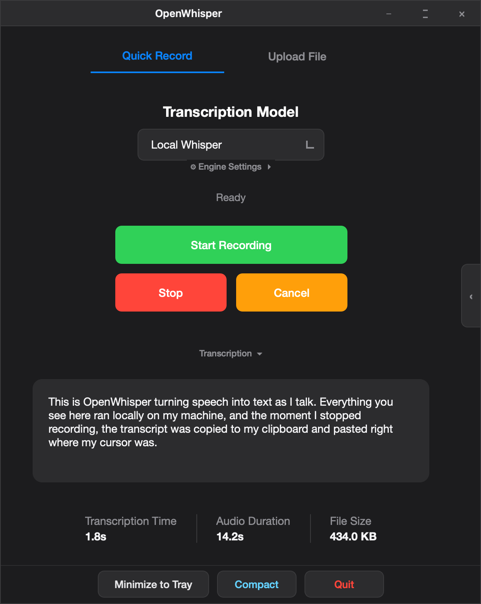
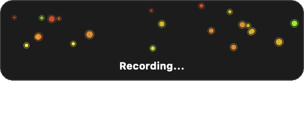
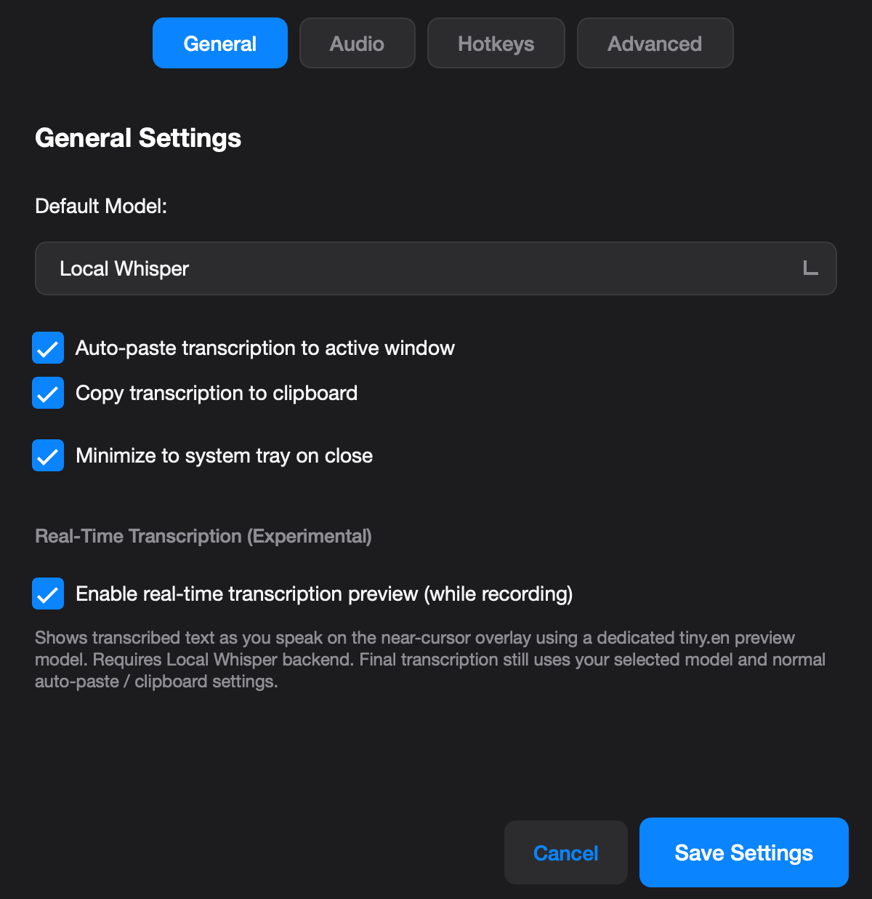
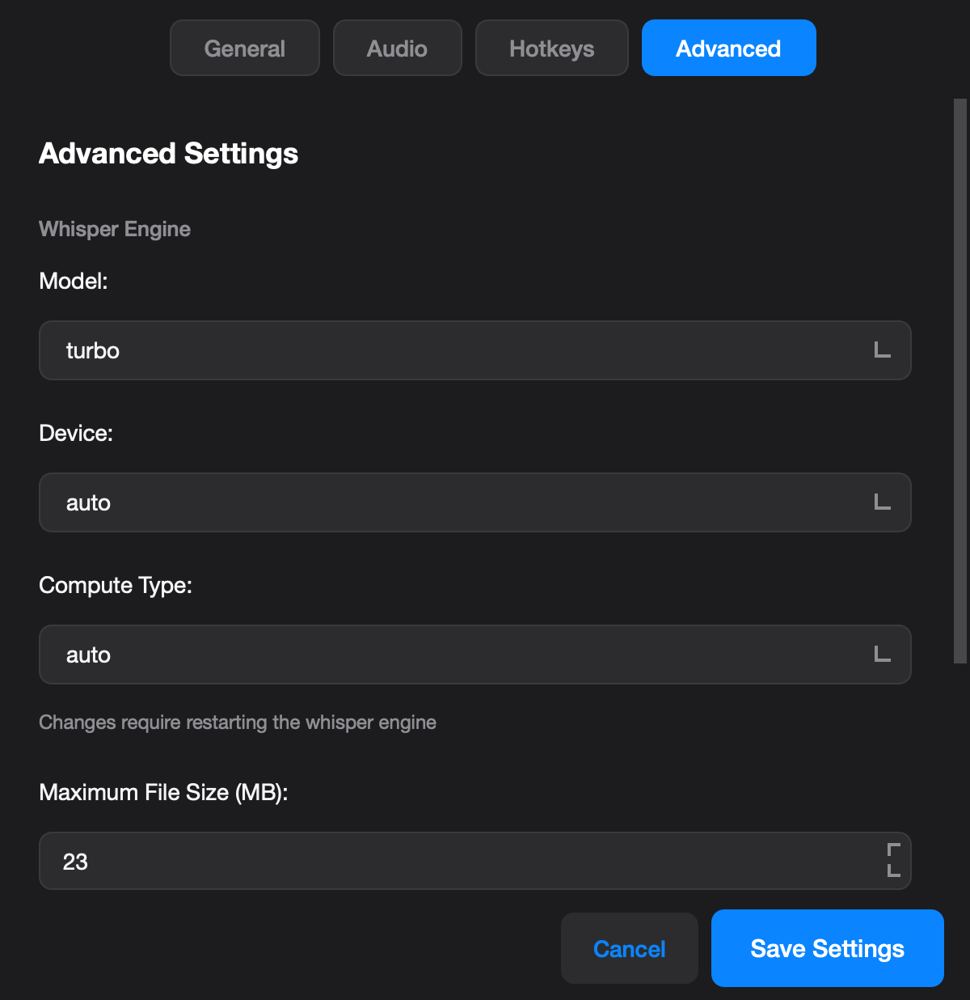

# OpenWhisper

**Website:** [openwhisper.fiorilabs.tech](https://openwhisper.fiorilabs.tech/)

A cross-platform desktop app (Windows, macOS, Linux) for recording audio and transcribing it to text using local Whisper models or OpenAI API. Features a modern PyQt6 GUI, system tray integration, global hotkeys, and auto-paste. The app detects your OS at runtime and adapts hotkey handling, auto-paste, and platform conventions automatically — see [Platform differences](#platform-differences).


<p align="center">
  
</p>

<p align="center">
  
</p>

<p align="center">
  
  
</p>


## Features

- **Local Whisper** – Runs offline with `faster-whisper`, using optimized Whisper models (~150MB download on first use)
- **API Options** – OpenAI Whisper API, GPT-4o Transcribe, GPT-4o Mini Transcribe
- **Global Hotkeys** – Start/stop recording from any app (customizable)
- **Auto-paste** – Transcription automatically pastes to your active window
- **System Tray** – Minimize to tray, always accessible
- **Smart Splitting** – Large audio files split automatically to avoid API limits
- **Audio Device Selection** – Choose your preferred microphone input
- **Transcription History** – Browse past transcriptions with search/filter, retranscribe recordings
- **Audio Upload** – Import existing audio files for transcription
- **Real-time Visualization** – Animated waveform overlay shows recording status
- **Live Streaming** *(experimental)* – Real-time transcription preview while recording
- **Caret Indicator** *(experimental)* – Visual marker at cursor location when pasting
- **Window Memory** – Remembers window position and size between sessions

## Platform differences

The same codebase runs on all three platforms; a few behaviors adapt to the OS:

| Area | Windows | macOS | Linux |
|------|---------|-------|-------|
| Global hotkeys | `keyboard` library (per-key suppression) | Carbon `RegisterEventHotKey` (no Accessibility permission; falls back to [`pynput`](https://pypi.org/project/pynput/) if registration fails) | `pynput` (observe-only) |
| Default hotkeys | Numpad (`*`, `-`, `Ctrl+Alt+*`) | Control+Option (`⌃⌥R`, `⌃⌥⎋`, `⌃⌥⇧R`) | Numpad (same as Windows) |
| Auto-paste | `Ctrl+V` | `Cmd+V` | `Ctrl+V` |
| Caret paste indicator | Tracks the real text caret (Win32 API) | Follows the mouse cursor (no public caret API) | Follows the mouse cursor |
| GPU | CUDA (NVIDIA) | CPU only (no Metal/MPS in faster-whisper) | CUDA (NVIDIA) |
| Launchers | `.cmd` + PowerShell, `pythonw.exe` | `install.sh` + shell scripts | `install.sh` + shell scripts |

> On Linux, `pynput` cannot selectively swallow individual key events, so hotkey combinations also reach the focused app. On macOS, Carbon hotkeys are registered with the OS (like VS Code or Slack) and do not require Accessibility permission; if Carbon registration fails, the app falls back to `pynput` and combos may leak to the focused app. The Control+Option defaults on macOS avoid clashing with Spotlight, 1Password, and other common shortcuts.

## GPU Acceleration (Windows / Linux)

For significantly faster transcription speeds with an NVIDIA GPU, install the CUDA runtime libraries used by faster-whisper (CTranslate2). These ship as pip wheels — **you do not need the CUDA Toolkit installer**:

```bash
pip install -r requirements-gpu.txt
```

This installs cuDNN 9, cuBLAS, and the CUDA 12 runtime (~750 MB, Windows only). OpenWhisper registers these DLL directories at startup — both via `os.add_dll_directory` and by prepending them to `PATH`, which is required because CTranslate2's loader ignores the former. No PATH editing or CUDA Toolkit needed. (CPU-only users should skip this file; transcription works fine without it.)

GPU auto-detection uses CTranslate2 directly, so **torch is not required**. With `device: auto`, the app detects the GPU and selects optimal settings (turbo model + float16 on GPU, base + int8 on CPU).

With CUDA enabled, faster-whisper runs 2-4x faster than CPU-only. Streaming transcription uses ~15-20% GPU vs 40-60% CPU. macOS has no CUDA support, so transcription runs on CPU there.

## Installation

**Note:** It's recommended to set up a virtual environment (venv) to avoid package version conflicts. I have found Python 3.12 to be pretty stable with this codebase.

```bash
git clone https://github.com/Knuckles92/OpenWhisper
cd OpenWhisper
python -m venv venv
# Windows
venv\Scripts\activate
# Linux/Mac
source venv/bin/activate
pip install -r requirements.txt
```

OPTIONAL: For cloud transcription, set your API key:
```bash
# Windows
set OPENAI_API_KEY=your-key

# macOS / Linux
export OPENAI_API_KEY=your-key

# Or create a .env file
OPENAI_API_KEY=your-key
```

## Required macOS permissions

macOS gates some features behind privacy permissions. Grant these to the app identity that is actually running OpenWhisper:

- **Microphone** — needed to record audio (System Settings > Privacy & Security > Microphone). You'll be prompted on first recording.
- **Accessibility** — needed only for **auto-paste** (the synthetic `Cmd+V` that inserts transcription into the focused app). Without it, transcriptions are still copied to the clipboard and you can paste manually. Global hotkeys work without Accessibility (Carbon `RegisterEventHotKey`).
- **Input Monitoring** *(optional)* — may be required when **remapping hotkeys** in Settings > Hotkeys (the capture dialog uses a `pynput` listener). Normal hotkey use does not need this.

For packaged builds, this should appear as the OpenWhisper app. For development launches from a virtualenv, use `scripts/openwhisper` or `ow`; on macOS the launcher runs through the framework `Python.app` so Accessibility has an app bundle it can select. If the list does not populate automatically, use the `+` button in Accessibility and add the app bundle shown in OpenWhisper's startup prompt, then fully quit and relaunch the app.

Do not add `venv/bin/python` manually if macOS greys it out in the picker. That path is usually a virtualenv symlink, and newer macOS pickers often only allow selecting app bundles from this dialog.

If auto-paste silently does nothing, Accessibility is still missing for the current launch identity. If hotkey capture in Settings fails, add Input Monitoring as well.

## Quick Launch (Windows)

For everyday use, you can register `ow` and `openwhisper` as global commands so the app launches from any terminal in any directory — no need to `cd` into the repo or activate the venv first.

### One-time install

From the repo root, run:

```
install.cmd
```

This adds `scripts\` to your user PATH (via the registry, not `setx` — see note below). It's idempotent, so running it twice does nothing the second time. **Open a new terminal afterward** for the change to take effect.

After install, both commands work from anywhere:

```
ow              # short alias
openwhisper     # full name
```

The launcher invokes `venv\Scripts\pythonw.exe` directly, so the app always uses the project's venv regardless of which environment your shell has activated. Code changes are picked up live — no reinstall needed after `git pull`.

### Uninstall

```
uninstall.cmd
```

Removes the PATH entry only. Your venv, code, and the `scripts/` folder are left untouched, so re-running `install.cmd` later will restore the commands.

### Manual install (no scripts)

If you can't or don't want to run the installer (e.g., corporate execution-policy restrictions), add the path yourself in PowerShell:

```powershell
$dir = "D:\path\to\whisper_local\scripts"   # <-- adjust to your clone location
$current = [Environment]::GetEnvironmentVariable("Path", "User")
if ($current -split ";" -notcontains $dir) {
    [Environment]::SetEnvironmentVariable("Path", "$current;$dir", "User")
}
```

> **Why not `setx`?** `setx PATH ...` from a `.cmd` file silently truncates PATH at 1024 characters and can duplicate System PATH entries into User PATH. `install.cmd` shells out to PowerShell, which writes directly to `HKCU\Environment\Path` via `[Environment]::SetEnvironmentVariable` — no truncation, no leakage between User and System scopes.

### Alternative: skip PATH editing

If you'd rather not modify your PATH at all, drop a copy of [scripts/openwhisper.cmd](scripts/openwhisper.cmd) into `%LOCALAPPDATA%\Microsoft\WindowsApps\` (which is already on Windows PATH for every user). Caveat: this is a *copy*, so you'd need to refresh it whenever the launcher logic changes — which is rare, but worth knowing.

## Quick Launch (macOS / Linux)

Register `ow` and `openwhisper` as global commands so the app launches from any terminal. From the repo root:

```bash
./install.sh
```

This adds the `scripts/` folder to your `PATH` via `~/.zprofile` (idempotent). Open a new terminal afterward, then run:

```bash
ow              # short alias
openwhisper     # full name
```

The launcher invokes `venv/bin/python` directly, so the app always uses the project's venv. Code changes are picked up live — no reinstall needed after `git pull`. To remove the PATH entry, run `./uninstall.sh` (your venv, code, and `scripts/` folder are left untouched).

## Usage

If you registered the launcher, just type `ow` or `openwhisper` from any terminal. Otherwise:

```bash
python app_qt.py
```

### Hotkeys

Default hotkeys depend on your platform (all remappable in **Settings > Hotkeys**):

| Action | Windows / Linux | macOS |
|--------|-----------------|-------|
| Start/stop recording | `*` (numpad) | `⌃⌥R` |
| Cancel | `-` (numpad) | `⌃⌥⎋` |
| Enable/disable program | `Ctrl+Alt+*` | `⌃⌥⇧R` |
| Minimize to tray | `Ctrl+Alt+M` | `⌃⌥M` |

On macOS, supported modifiers are `⌘` (Command), `⌃` (Control), `⌥` (Option), `⇧` (Shift).

## Settings

Access settings via **File > Settings** or the system tray menu. Available options:

**General:** Default model, auto-paste, clipboard copy, minimize to tray, streaming transcription (experimental)

**Audio:** Sample rate, channels, silence threshold, input device selection

**Hotkeys:** Customize all keyboard shortcuts

**Advanced:** Whisper model selection (14+ options), compute device (auto/cuda/cpu), compute type (float16/float32/int8), max file size before splitting, streaming overlay positioning, logging, Hugging Face download policy

## Offline Usage and Model Downloads

Model loading is **cache-first**: models already on your computer always load locally, with no Hugging Face network checks — not even a metadata call. Hugging Face is contacted only when a model you request is missing from the local cache, and only with your consent.

The download policy lives in **Settings → Advanced → Hugging Face Downloads**:

- **Ask before downloading** (default): a consent dialog appears when a missing model is needed, showing the model, its Hugging Face repository, and an approximate download size. You can approve just that download ("Download once") or switch to always allowing downloads.
- **Always allow downloads**: missing models download without prompting. Cached models are still never re-checked for updates.
- **Never connect (fully offline)**: no downloads unless you explicitly approve a one-time override in the dialog.

Setting `HF_HUB_OFFLINE=1` in the environment before launching is a hard override that disables downloads entirely (still supported for scripts and CI):

```bash
export HF_HUB_OFFLINE=1  # Linux/Mac
set HF_HUB_OFFLINE=1     # Windows
python app_qt.py
```

Upgrading from an older version: the previous **Skip HuggingFace network checks** toggle migrates automatically — enabled becomes **Never connect**, disabled becomes **Ask before downloading**.
## Requirements

- Python 3.8+ (3.12 recommended)
- Windows, macOS, or Linux

**Note:** The caret paste indicator tracks the real text caret only on Windows (uses the Win32 API). On macOS and Linux it follows the mouse cursor, since there is no public caret-position API.

## License

MIT License. Free to use, clone, and modify.
