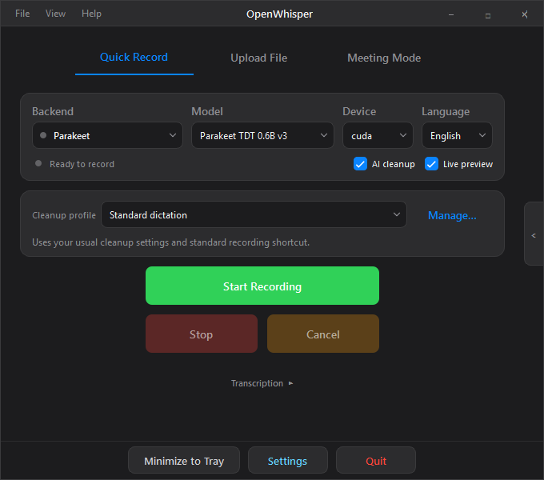
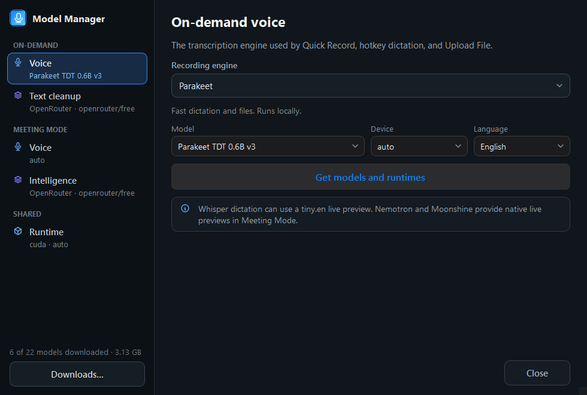
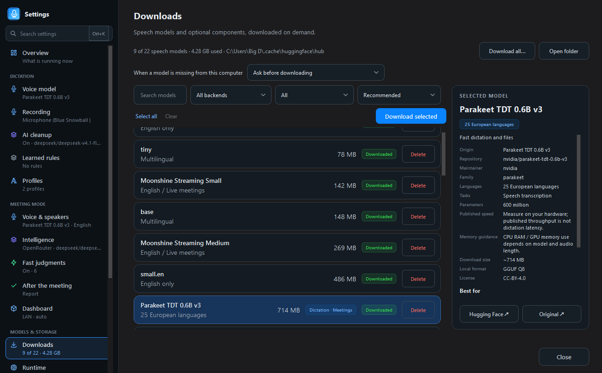
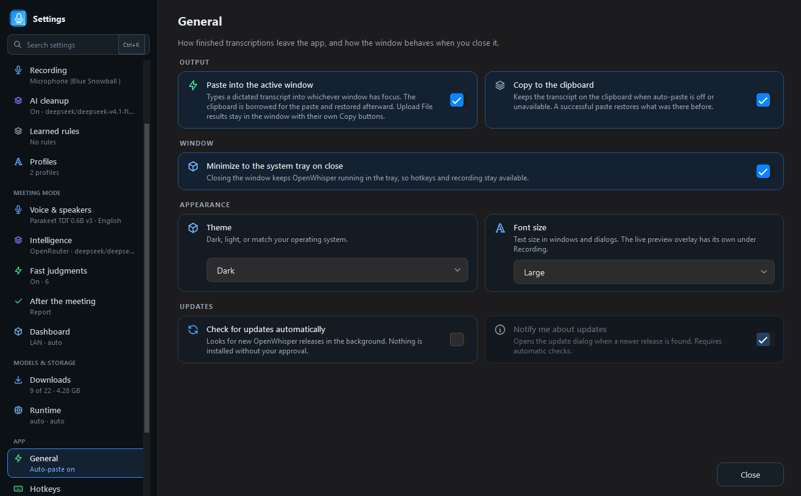

# OpenWhisper

**Website:** [openwhisper.fiorilabs.tech](https://openwhisper.fiorilabs.tech/)

A cross-platform desktop app (Windows, macOS, Linux) for recording audio and transcribing it to text using local Whisper models or OpenAI API. Features a modern PyQt6 GUI, system tray integration, global hotkeys, and auto-paste. The app detects your OS at runtime and adapts hotkey handling, auto-paste, and platform conventions automatically — see [Platform differences](#platform-differences).


<p align="center">
  
</p>

<p align="center">
  
</p>

<p align="center">
  
</p>

<p align="center">
  
</p>

<p align="center">
  
</p>


## Features

- **Local Whisper** – Runs offline with `faster-whisper`, using optimized Whisper models (~150MB download on first use)
- **Model Manager** – Manage voice and text models in one place: browse, download, and activate local Whisper models, or use a guided provider → model picker for OpenAI/OpenRouter cleanup models
- **API Options** – Choose **API** as the backend, then select GPT-Transcribe (default), GPT-4o Transcribe, GPT-4o Mini Transcribe, or Whisper in **Model**. **Local Whisper** keeps its own model, device, and quantization controls.
- **AI Transcript Cleanup & Learned Rules** – Post-process transcripts with LLMs (OpenAI, OpenRouter, or custom OpenAI-compatible endpoints) and teach custom spelling and style rules via text or voice dictation
- **Global Hotkeys** – Start/stop recording from any app (customizable)
- **Auto-paste** – Dictated transcription automatically pastes to your active window (Upload File results stay in the app, with Copy buttons)
- **System Tray** – Minimize to tray when the desktop session provides one
- **Smart Splitting (API)** – Large audio files split automatically to avoid API limits
- **Audio Device Selection** – Choose your preferred microphone input
- **Transcription History** – Browse past transcriptions with search/filter, retranscribe recordings, and export Markdown, plain text, or JSON
- **Audio Upload** – Import existing audio files for transcription
- **Real-time Visualization** – Animated waveform overlay shows recording status
- **Live Streaming** – Real-time transcription preview while recording
- **Meeting Mode (Windows, macOS 13+)** – Record microphone and system audio
  into a durable, searchable meeting transcript; share a tokenized live
  dashboard, review evidence-linked insights, play the recording, and export
  the result. After local transcription finishes, choose **Continue in the
  background** to start another meeting while cleanup and reports finish;
  open the results from Past Meetings. Linux x86_64/aarch64 has an in-tree Pulse/PipeWire path gated
  behind a versioned preview acknowledgement until hardware attestation.
- **Window Memory** – Remembers window position and size between sessions

## Platform differences

The same codebase runs on all three platforms; a few behaviors adapt to the OS:

| Area | Windows | macOS | Linux |
|------|---------|-------|-------|
| Global hotkeys | `keyboard` library (per-key suppression) | Carbon `RegisterEventHotKey` (no Accessibility permission; falls back to [`pynput`](https://pypi.org/project/pynput/) if registration fails) | `pynput` (X11/XWayland; compositor-limited on Wayland) |
| Default hotkeys | Numpad (`*`, `-`, `Ctrl+Alt+*`) | Control+Option (`⌃⌥R`, `⌃⌥⎋`, `⌃⌥⇧R`) | Numpad (same as Windows) |
| Auto-paste | `Ctrl+V` | `Cmd+V` | `Ctrl+V` |
| GPU | CUDA (NVIDIA) — downloadable component or pip wheels | CPU only (no Metal/MPS in faster-whisper) | CUDA (NVIDIA) — pip wheels |
| Meeting Mode system audio | WASAPI loopback, with a `soundcard` fallback | ScreenCaptureKit (macOS 13+), needs Screen Recording | Implementation present (Pulse/PipeWire-Pulse); public support gated pending hardware attestation — try-anyway after ack |
| Distribution / launchers | Native `.exe` installer | Apple Silicon `.dmg` preview (unnotarized) or source + `install.sh` | Native `.deb` / `.pkg.tar.zst` installers; `openwhisper` / `ow` commands |

> On Linux, `pynput` cannot selectively swallow individual key events, so hotkey combinations also reach the focused app. Native Wayland security prevents `pynput` from reliably observing or injecting keys across other native Wayland applications; global hotkeys and auto-paste therefore require an X11 session (or may work only with XWayland windows). Recording, transcription, clipboard copy, and the rest of the UI remain available on Wayland. On macOS, Carbon hotkeys are registered with the OS (like VS Code or Slack) and do not require Accessibility permission; if Carbon registration fails, the app falls back to `pynput` and combos may leak to the focused app. The Control+Option defaults on macOS avoid clashing with Spotlight, 1Password, and other common shortcuts.

## GPU Acceleration (Windows / Linux)

**Prerequisite (both platforms):** an NVIDIA driver providing CUDA 12 — version 525 or newer. The driver supplies `nvcuda.dll` / `libcuda.so.1` and never comes from pip. **You do not need the CUDA Toolkit installer.**

> **Native packages ship CPU transcription only.** On Windows, NVIDIA GPU acceleration remains an optional ~633 MB verified download from **Manage models → Components**. The Linux packages do not currently install CUDA into their frozen runtime; Linux users who need NVIDIA acceleration should use the source install plus `requirements-gpu.txt` below.

Running **from source**, install the CUDA libraries faster-whisper's engine (CTranslate2) loads at runtime:

```bash
pip install -r requirements-gpu.txt
```

That pulls cuBLAS plus NVRTC and the CUDA 12 runtime — roughly 630 MB of wheels on Windows, a little more on Linux, and under 1 GB once installed. (The component figures above are smaller because the component extracts only the DLLs, not the whole wheels.) CPU-only users should skip this file; transcription works fine without it. macOS users should skip it too: faster-whisper has no Metal/MPS backend, so transcription runs on CPU there.

**cuDNN is deliberately not installed.** CTranslate2 4.8 has no import-table entry and no `LoadLibrary`/`dlopen` name string for cuDNN on either platform, and a GPU transcription with cuDNN fully removed loads zero cuDNN modules — so the `nvidia-cudnn-cu12` wheel (737 MB on Windows, 799 MB on Linux) would be pure download weight.

How the libraries get found differs by platform, because Linux has no mutable equivalent of the Windows DLL search path:

| Platform | Mechanism |
|----------|-----------|
| Windows | `app_qt._register_cuda_dll_directories()` registers the wheels' `bin` directories with `os.add_dll_directory` **and** prepends them to `PATH` — both are needed, because CTranslate2's loader ignores the former |
| Linux | `app_qt._preload_cuda_libraries()` loads the `.so` files with `RTLD_GLOBAL` before the model loads, so CTranslate2's later `dlopen("libcublas.so.12")` resolves to the already-loaded object. `LD_LIBRARY_PATH` is read by `ld.so` at process start and cannot be changed from inside a running process; `scripts/openwhisper` also exports it for good measure |

Either way, no PATH editing and no CUDA Toolkit. GPU auto-detection uses CTranslate2 directly, so **torch is not required**. With `device: auto`, the app detects the GPU and selects optimal settings (turbo model + float16 on GPU, base + int8 on CPU). If a GPU is detected but its libraries cannot be loaded, the model falls back to CPU with a warning in `openwhisper.log` rather than failing.

**Older GPUs (Pascal and earlier):** CTranslate2 does not support `float16` there, so `auto` falls back to `int8_float32` rather than `float32`. This matters more than it sounds: measured on a 4 GB GTX 1050 Ti, the auto-selected turbo model peaked at **3957/4096 MiB and ran out of memory** at `float32`, versus **1377 MiB with headroom to spare** at `int8_float32`. Turbo runs on the GPU on a 4 GB card as a result, and cold start dropped from ~113 s to ~27 s. Cards that support `float16` never reach this fallback and are unaffected. Verified with driver 580 / CUDA 13 — a newer driver than the CUDA 12 wheels, which is fine.

With CUDA enabled, faster-whisper runs 2-4x faster than CPU-only. Streaming transcription uses ~15-20% GPU vs 40-60% CPU.

## Installation

### Windows — installer (recommended)

Download **OpenWhisper-Setup-2.5.2.exe** from [openwhisper.fiorilabs.tech](https://openwhisper.fiorilabs.tech/) or the [Releases page](https://github.com/Knuckles92/OpenWhisper/releases), then run it.

- No Python, no admin rights, no UAC prompt — it installs per-user to `%LOCALAPPDATA%\Programs\OpenWhisper`.
- Settings, history, and recordings live in `%LOCALAPPDATA%\OpenWhisper` and are kept if you reinstall.
- A speech model (~150 MB) downloads on first use, with a consent prompt.
- **Help → Check for Updates** fetches the latest GitHub release. Per-user Windows installs download a verified update archive and apply it in-app (no Inno wizard). Elevated / Program Files installs, or a missing archive, still use the verified setup exe. Updating from 2.5.1 to 2.5.2 opens the setup wizard once to install the repaired updater. Native updates resume when a later release includes a compatible update archive. Turn automatic checks or notifications off in **Settings → General**, or on the first update prompt.

> **SmartScreen warning:** the installer is not yet code-signed, so Windows shows *"Windows protected your PC"*. Click **More info → Run anyway**. Verify the download by comparing its SHA-256 against the checksum published next to the download link:
> ```powershell
> Get-FileHash .\OpenWhisper-Setup-2.5.2.exe -Algorithm SHA256
> ```

To uninstall, use *Settings → Apps → Installed apps*. You'll be asked whether to keep your settings and history.

### Linux — native Debian package (recommended)

Download **OpenWhisper-2.5.2-linux-amd64.deb** from the [Releases page](https://github.com/Knuckles92/OpenWhisper/releases), then install it with APT so required audio and Qt system libraries are resolved automatically:

```bash
sudo apt install ./OpenWhisper-2.5.2-linux-amd64.deb
```

- Supports x86-64 Debian 12+, Ubuntu 22.04+, and compatible derivatives.
- No Python or virtual environment is needed. The package installs the private app bundle under `/usr/lib/openwhisper`, adds the desktop-menu entry, and provides both `openwhisper` and `ow` commands.
- Settings, history, recordings, and app-managed components live outside the package under `${XDG_DATA_HOME:-~/.local/share}/OpenWhisper`, so upgrades and normal removal preserve them. Downloaded Whisper models use the shared Hugging Face cache under `${HF_HOME:-~/.cache/huggingface}`.
- **Help → Check for Updates** reports new releases but does not bypass APT/dpkg ownership. Download the new `.deb` and run the same command to upgrade.
- The package is CPU-only. Use the source installation below when NVIDIA CUDA acceleration is required.
- Tray integration is used only when the desktop exposes a system tray; otherwise tray-only controls are disabled and closing the main window exits normally. On native Wayland, use the in-app controls and clipboard copy unless you switch to an X11 session for global hotkeys and auto-paste.

Verify a download against `SHA256SUMS.txt` from the same release:

```bash
sha256sum -c SHA256SUMS.txt --ignore-missing
```

Remove the application with `sudo apt remove openwhisper`. To also remove OpenWhisper's per-user settings, history, recordings, and app-managed components, delete `~/.local/share/OpenWhisper` (or `$XDG_DATA_HOME/OpenWhisper`) yourself. Whisper models remain in the shared `${HF_HOME:-~/.cache/huggingface}` cache; remove that cache separately only if you understand it may also contain models used by other applications.

### Linux — native Arch package

Download **OpenWhisper-2.5.2-linux-x86_64.pkg.tar.zst** from the [Releases page](https://github.com/Knuckles92/OpenWhisper/releases), then install it with pacman so required audio and Qt system libraries are resolved automatically:

```bash
sudo pacman -U ./OpenWhisper-2.5.2-linux-x86_64.pkg.tar.zst
```

- Supports x86-64 Arch Linux and compatible derivatives (Manjaro, EndeavourOS).
- No Python or virtual environment is needed. The package installs the private app bundle under `/usr/lib/openwhisper`, adds the desktop-menu entry, and provides both `openwhisper` and `ow` commands.
- Settings, history, recordings, and app-managed components live outside the package under `${XDG_DATA_HOME:-~/.local/share}/OpenWhisper`, so upgrades and normal removal preserve them. Downloaded Whisper models use the shared Hugging Face cache under `${HF_HOME:-~/.cache/huggingface}`.
- **Help → Check for Updates** reports new releases but does not bypass pacman ownership. Download the new `.pkg.tar.zst` and run the same command to upgrade.
- The package is CPU-only. Use the source installation below when NVIDIA CUDA acceleration is required.
- Tray integration is used only when the desktop exposes a system tray; otherwise tray-only controls are disabled and closing the main window exits normally. On native Wayland, use the in-app controls and clipboard copy unless you switch to an X11 session for global hotkeys and auto-paste.

Verify a download against `SHA256SUMS.txt` from the same release:

```bash
sha256sum -c SHA256SUMS.txt --ignore-missing
```

Remove the application with `sudo pacman -R openwhisper`. To also remove OpenWhisper's per-user settings, history, recordings, and app-managed components, delete `~/.local/share/OpenWhisper` (or `$XDG_DATA_HOME/OpenWhisper`) yourself. Whisper models remain in the shared `${HF_HOME:-~/.cache/huggingface}` cache; remove that cache separately only if you understand it may also contain models used by other applications.

> Fedora, ARM64, and older-glibc systems are not targets of the official Linux packages; use the source installation below. A Linux PyInstaller bundle inherits the glibc floor of its build host, so official packages are built on Ubuntu 22.04 and record their actual minimum glibc requirement.

### macOS — Apple Silicon DMG (preview)

Download **OpenWhisper-*-macos-arm64.dmg** from the [Releases page](https://github.com/Knuckles92/OpenWhisper/releases).

- **Apple Silicon only** (arm64). macOS **14 (Sonoma) or newer**.
- Open the disk image and drag **OpenWhisper** into **Applications**.
- The app inside the DMG is **ad-hoc signed**; the DMG is **not notarized**. The first launch is blocked by Gatekeeper until you approve it once:
  1. Open OpenWhisper from Applications (or double-click it in the DMG).
  2. When macOS reports that the developer cannot be verified, open **System Settings → Privacy & Security**.
  3. Find the OpenWhisper message near the bottom of the Security section and choose **Open Anyway**.
  4. Confirm **Open** when prompted. Subsequent launches use the same exception.
- Do **not** turn Gatekeeper off, and do **not** strip quarantine attributes as a normal install step. Apple’s Open Anyway flow is the supported override for an unnotarized build.
- Settings, history, and recordings live in `~/Library/Application Support/OpenWhisper` and survive replacing the app bundle.
- **Help → Check for Updates** reports new releases but does not replace the app. Download the new DMG and drag OpenWhisper into Applications again.
- Transcription is CPU-only on macOS. Downloadable Windows/Linux components (GPU Acceleration, Meeting Agent) are not offered on Mac.
- Grant **Microphone**, and for Meeting Mode **Screen & System Audio Recording**, under Privacy & Security when prompted. Auto-paste still needs **Accessibility** for the OpenWhisper app identity. See [Required macOS permissions](#required-macos-permissions).

Verify a download against `SHA256SUMS.txt` from the same release:

```bash
shasum -a 256 -c SHA256SUMS.txt --ignore-missing
```

Intel Macs, older macOS releases, and signed/notarized distribution are not covered by this preview; use the source installation below or wait for a later release.

### Install from source (all platforms)

Use this for Intel Macs, older macOS, Fedora, development, or Linux NVIDIA GPU acceleration.

**Python:** 3.11–3.12 recommended (3.11 verified; 3.12 stable). 3.13 works, but on Debian/Ubuntu you need `python3-dev` and a compiler because `pynput` → `evdev` has no prebuilt wheel for 3.13 yet.

**Note:** Use a virtual environment (venv) to avoid package version conflicts.

On a minimal **Debian / Ubuntu / Pop!_OS** install, install Python and the system libraries PyQt6 and `sounddevice` need before creating the venv. On a fresh box, run `apt update` first:

```bash
sudo apt update
sudo apt install -y \
  python3 python3-venv python3-dev build-essential \
  libportaudio2 libegl1 libgl1 libxcb-cursor0 libxkbcommon-x11-0 \
  libxcb-icccm4 libxcb-keysyms1 libxcb-shape0 libxcb-xkb1
```

`libportaudio2` backs `sounddevice` (recording). The Qt/XCB packages cover EGL, cursor, keyboard, and ICCCM support — without them the app can fail at import with missing `libEGL.so.1` or with *"no Qt platform plugin could be initialized"*. `./install.sh`, `scripts/openwhisper`, and `python app_qt.py` probe these libraries on Linux and print the matching `apt` / `dnf` / `pacman` command instead of a raw `ImportError`. Clipboard copy uses Qt and does not require `xclip` or `wl-clipboard`.

Meeting Mode on Linux also needs a Pulse-compatible desktop audio session (native PulseAudio or PipeWire with `pipewire-pulse`) and the Pulse client library (`libpulse0` / `pulseaudio-libs` / `libpulse`). OpenWhisper detects the default-sink loopback with SoundCard first; `pactl` is only an optional fallback for nonstandard monitor names (`pulseaudio-utils` on Debian/Ubuntu and Fedora/RHEL, `libpulse` on Arch). If system audio is missing, OpenWhisper shows distro-specific setup commands and can continue microphone-only for that meeting. See [`docs/linux-system-audio.md`](docs/linux-system-audio.md).

**Fedora / RHEL:**

```bash
sudo dnf install -y \
  python3 python3-devel gcc portaudio \
  xcb-util-cursor xcb-util-keysyms xcb-util-wm \
  libxkbcommon-x11 mesa-libEGL libglvnd-glx
```

**Arch Linux:**

```bash
sudo pacman -S --needed \
  python python-pip base-devel portaudio \
  xcb-util-cursor xcb-util-keysyms xcb-util-wm \
  libxkbcommon libgl
```

```bash
git clone https://github.com/Knuckles92/OpenWhisper
cd OpenWhisper
# Windows
python -m venv venv
venv\Scripts\activate
# macOS / Linux
python3 -m venv venv
source venv/bin/activate
pip install -r requirements.txt
```

**Help → Check for Updates** still works from a source checkout: it tells you when a newer GitHub release exists and offers the release notes. It will not overwrite the tree. Update with `git pull --ff-only` and `pip install -r requirements.txt` if dependencies changed. Automatic checks and notifications can be turned off in **Settings → General**.

### Building the native installers yourself

**Windows** (PowerShell):

```powershell
.\venv\Scripts\activate
pip install -r requirements.txt -r requirements-build.txt -c requirements-release-constraints.txt
winget install -e --id JRSoftware.InnoSetup
.\scripts\build_installer.ps1 -Clean
```

This creates `OpenWhisper-Setup-<version>.exe` and the Windows in-app update payload `OpenWhisper-<version>-win64.tar.xz` under `installer\Output\`.

**Linux** (x86-64 Debian/Ubuntu; build on Ubuntu 22.04 for the release compatibility floor):

```bash
sudo apt install -y \
  python3 python3-venv python3-dev build-essential binutils dpkg-dev file patchelf \
  desktop-file-utils libarchive-tools lintian xvfb xauth zstd \
  libdrm2 libegl1 libgl1 libportaudio2 \
  libwayland-client0 libwayland-cursor0 libwayland-egl1 \
  libxcb-cursor0 libxkbcommon-x11-0 \
  libxcb-icccm4 libxcb-keysyms1 libxcb-shape0 libxcb-xkb1
python3 -m venv venv
venv/bin/pip install -r requirements.txt -r requirements-build.txt -c requirements-release-constraints.txt
./scripts/build_installer.sh --clean
```

This creates `OpenWhisper-<version>-linux-amd64.deb` and `OpenWhisper-<version>-linux-x86_64.pkg.tar.zst` from the same frozen tree, validates the desktop metadata and package control fields, checks every bundled ELF for unresolved libraries, and runs the frozen import self-test under Xvfb. The script prints each package SHA-256.

**macOS** (Apple Silicon host only):

```bash
python3 -m venv venv
venv/bin/pip install -r requirements.txt -r requirements-build.txt -c requirements-release-constraints.txt
./scripts/build_installer_macos.sh --clean
```

This freezes `OpenWhisper.app`, verifies Info.plist identity and privacy keys, runs `--version` / `--self-test`, checks the ad-hoc code signature and arm64 Mach-O slices, and writes `OpenWhisper-<version>-macos-arm64.dmg` under `installer/Output/`. The build host must be Darwin arm64; Intel Macs are rejected. The DMG is intentionally unnotarized until a Developer ID pipeline is added.

The **Build native installers** GitHub Actions workflow builds Windows, Linux, and macOS in parallel and produces one combined release-candidate artifact; an optional workflow-dispatch input uploads all five native files plus `SHA256SUMS.txt` to an existing draft release. Native release builds use the reviewed exact versions in [`requirements-release-constraints.txt`](requirements-release-constraints.txt), while ordinary source installs retain the compatible ranges in `requirements.txt`. See [`OpenWhisper.spec`](OpenWhisper.spec) for the shared frozen-bundle definition and [`docs/release-checklist.md`](docs/release-checklist.md) before publishing.

### Optional downloadable components

The Windows installer is CPU-only. GPU acceleration (Windows) and the Meeting Intelligence Agent (Windows x64 and Linux x86_64/aarch64) are installed later from **Downloads** inside the app. Those URLs live in [`services/components.py`](services/components.py) — not on `/releases/latest`, and not on the website (except an unpublished speaker-id placeholder). Every archive is SHA-256 verified before extract.

| What | Where the bytes come from | Moves when |
| --- | --- | --- |
| Windows installer (`OpenWhisper-Setup-*.exe`) | Latest GitHub Release | Every app release |
| Windows native update archive (`OpenWhisper-*-win64.tar.xz`) | Same GitHub Release | Every app release (in-app apply) |
| Linux Debian package (`OpenWhisper-*-linux-amd64.deb`) | Same GitHub Release | Every app release (APT/dpkg upgrade) |
| Linux Arch package (`OpenWhisper-*-linux-x86_64.pkg.tar.zst`) | Same GitHub Release | Every app release (`pacman -U` upgrade) |
| macOS Apple Silicon DMG (`OpenWhisper-*-macos-arm64.dmg`) | Same GitHub Release | Every app release (manual replace; unnotarized preview) |
| `gpu-accel` | PyPI NVIDIA wheels | The CUDA pin in `requirements-gpu.txt` changes |
| `meeting-agent` | nodejs.org + a zip on the GitHub tag in `MEETING_AGENT_RELEASE_TAG` | Node or the sidecar bundle changes |
| `speaker-id` | Unpublished placeholder | — |

An app patch updates all five application artifacts. Existing component pins stay put so Downloads keep working.

#### Updating the GPU component

To move to newer CUDA wheels, bump the pins in `requirements-gpu.txt`, then:

```powershell
python scripts\build_component.py gpu-accel
```

That resolves what pip would install for `win_amd64`, records the SHA-256 pip reports for each wheel, downloads them to measure the extracted payload, and prints a ready-to-paste `_BUILTIN_GPU_ARCHIVES` block plus the matching `install_bytes`. Paste both into `services/components.py` and bump `GPU_COMPONENT_VERSION` so existing installs are offered the new payload.

Two things not to skip: `install_bytes` drives the pre-install free-space check, so it must be the measured value the script prints rather than an estimate; and `GPU_COMPONENT_VERSION` is what the Model Manager compares against an installed manifest, so leaving it unchanged means nobody is told an update exists.

#### Updating the meeting-agent component

Leave the catalog alone when only the app changed. Rebuild when Node or `sidecar/` changes:

```powershell
python scripts\build_component.py meeting-agent
```

That pins official Node archives for Windows x64, Linux x64, and Linux ARM64 from nodejs.org, builds `sidecar/dist/bundle.cjs` once, zips the platform-neutral bundle, and prints a ready-to-paste `_BUILTIN_MEETING_AGENT_BY_PLATFORM` block covering `win_amd64`, `linux_x86_64`, and `linux_aarch64`. Attach the bundle zip to the GitHub Release whose tag you set as `MEETING_AGENT_RELEASE_TAG`, paste the block, and bump `MEETING_AGENT_COMPONENT_VERSION` so existing installs are offered the new payload. Do not replace the zip on an older tag — GitHub assets are treated as immutable.

OPTIONAL: For cloud transcription, transcript cleanup, or meeting intelligence, add API keys under **Settings → API keys**. They are saved in your operating system's credential store (Windows Credential Manager, macOS Keychain, or Secret Service on Linux), never in the settings file or the log, and a **Test** button checks a key against the provider before you rely on it. Environment variables or a `.env` file still work and are used when no key is saved:

```bash
# Windows
set OPENAI_API_KEY=your-key
set OPENROUTER_API_KEY=your-key

# macOS / Linux
export OPENAI_API_KEY=your-key
export OPENROUTER_API_KEY=your-key

# Or create a .env file
OPENAI_API_KEY=your-key
OPENROUTER_API_KEY=your-key
```

Custom OpenAI-compatible text endpoints (LM Studio, vLLM, Ollama `/v1`, LiteLLM, or a private gateway) are added in **Model Manager**. Each named profile stores only a display name, base URL, and optional API-key environment-variable name. Leave the variable blank for an auth-free local server. You can type a model id by hand if `/models` is unavailable.

## Required macOS permissions

macOS gates some features behind privacy permissions. Grant these to the app identity that is actually running OpenWhisper:

- **Microphone** — needed to record audio (System Settings > Privacy & Security > Microphone). You'll be prompted on first recording.
- **Screen & System Audio Recording** — needed for **Meeting Mode** to capture the other side of a call. macOS has no loopback input device, so system audio comes from a ScreenCaptureKit stream; only its audio is read and every video frame is discarded. Without this grant a meeting still runs, but records your microphone only, so you would be the only speaker in the transcript. OpenWhisper asks for it when you start a meeting.
- **Accessibility** — needed only for **auto-paste** (the synthetic `Cmd+V` that inserts transcription into the focused app). Without it, transcriptions are still copied to the clipboard and you can paste manually. Global hotkeys work without Accessibility (Carbon `RegisterEventHotKey`).
- **Input Monitoring** *(optional)* — may be required when **remapping hotkeys** in Settings > Hotkeys (the capture dialog uses a `pynput` listener). Normal hotkey use does not need this.

To check the system-audio path independently of the app, run `.venv/bin/python scripts/probe_macos_loopback.py` with something playing. It reports the grant, verifies audio actually flows, and prints the captured level.

For packaged builds, this should appear as the OpenWhisper app. For development launches from a virtualenv, use `scripts/openwhisper` or `ow`; on macOS the launcher runs through the framework `Python.app` so Accessibility has an app bundle it can select. If the list does not populate automatically, use the `+` button in Accessibility and add the app bundle shown in OpenWhisper's startup prompt, then fully quit and relaunch the app.

Do not add `venv/bin/python` manually if macOS greys it out in the picker. That path is usually a virtualenv symlink, and newer macOS pickers often only allow selecting app bundles from this dialog.

If auto-paste silently does nothing, Accessibility is still missing for the current launch identity. If hotkey capture in Settings fails, add Input Monitoring as well.

## Quick Launch (Windows)

For everyday use, you can register `ow` and `openwhisper` as global commands so the app launches from any terminal in any directory — no need to `cd` into the repo or activate the venv first.

### One-time install

From the repo root, run:

```
install.cmd
```

This adds `scripts\` to your user PATH (via the registry, not `setx` — see note below). It's idempotent, so running it twice does nothing the second time. **Open a new terminal afterward** for the change to take effect.

After install, both commands work from anywhere:

```
ow              # short alias
openwhisper     # full name
```

The launcher invokes `venv\Scripts\pythonw.exe` directly, so the app always uses the project's venv regardless of which environment your shell has activated. Code changes are picked up live — no reinstall needed after `git pull`.

### Uninstall

```
uninstall.cmd
```

Removes the PATH entry only. Your venv, code, and the `scripts/` folder are left untouched, so re-running `install.cmd` later will restore the commands.

### Manual install (no scripts)

If you can't or don't want to run the installer (e.g., corporate execution-policy restrictions), add the path yourself in PowerShell:

```powershell
$dir = "D:\path\to\OpenWhisper\scripts"   # <-- adjust to your clone location
$current = [Environment]::GetEnvironmentVariable("Path", "User")
if ($current -split ";" -notcontains $dir) {
    [Environment]::SetEnvironmentVariable("Path", "$current;$dir", "User")
}
```

> **Why not `setx`?** `setx PATH ...` from a `.cmd` file silently truncates PATH at 1024 characters and can duplicate System PATH entries into User PATH. `install.cmd` shells out to PowerShell, which writes directly to `HKCU\Environment\Path` via `[Environment]::SetEnvironmentVariable` — no truncation, no leakage between User and System scopes.

### Alternative: skip PATH editing

If you'd rather not modify your PATH at all, drop a copy of [scripts/openwhisper.cmd](scripts/openwhisper.cmd) into `%LOCALAPPDATA%\Microsoft\WindowsApps\` (which is already on Windows PATH for every user). Caveat: this is a *copy*, so you'd need to refresh it whenever the launcher logic changes — which is rare, but worth knowing.

## Quick Launch (macOS / Linux)

Register `ow` and `openwhisper` as global commands so the app launches from any terminal. From the repo root:

```bash
./install.sh
```

This adds the `scripts/` folder to your `PATH` in your shell profile files (`~/.bashrc`, `~/.zprofile`, and on macOS also `~/.bash_profile`; fish users get `~/.config/fish/config.fish`). It is idempotent. The installer prints the exact `source …` command for your shell — run that in your current terminal, or open a new one, then run:

```bash
ow              # short alias
openwhisper     # full name
```

The launcher invokes `venv/bin/python` directly, so the app always uses the project's venv. Code changes are picked up live — no reinstall needed after `git pull`. To remove the PATH entry, run `./uninstall.sh` (your venv, code, and `scripts/` folder are left untouched).

## Usage

If you registered the launcher, just type `ow` or `openwhisper` from any terminal. Otherwise:

```bash
# macOS / Linux
python3 app_qt.py
# Windows
python app_qt.py
```

### Hotkeys

Default hotkeys depend on your platform (all remappable in **Settings > Hotkeys**):

| Action | Windows / Linux | macOS |
|--------|-----------------|-------|
| Start/stop recording | `*` (numpad) | `⌃⌥R` |
| Cancel | `-` (numpad) | `⌃⌥⎋` |
| Enable/disable program | `Ctrl+Alt+*` | `⌃⌥⇧R` |
| Minimize to tray | `Ctrl+Alt+M` | `⌃⌥M` |

On macOS, supported modifiers are `⌘` (Command), `⌃` (Control), `⌥` (Option), `⇧` (Shift).

**Recording activation** (Settings > Hotkeys) chooses how the record hotkey behaves:

- **Toggle** (default) — press to start recording, press again to stop and transcribe.
- **Push and hold** — hold the hotkey to record; release to stop and transcribe. Taps shorter than 250 ms are canceled instead of transcribed.

## Settings

Access settings via **File > Settings** or the system tray menu. Available options:

- **General:** Auto-paste, copy to clipboard, minimize to system tray on close, UI font size (Small / Default / Large / Extra large), automatic update checks and notifications, saved recordings retention policy, and real-time streaming transcription preview toggle and font size.
- **Audio:** Sample rate, channels, silence threshold, and microphone input device selection.
- **Hotkeys:** Customize all global shortcuts and choose how the record hotkey activates (toggle, or push-and-hold like a walkie-talkie).
- **Cleanup:** AI transcript cleanup settings (enable/disable, thinking level, custom prompt) and **Learned Rules** library (teach personal spelling and formatting rules via text or voice dictation). Text provider and model selection are configured in **Model Manager**.
- **Meeting:** Meeting Mode options including knowledge folder search, past transcript search/recall, end-of-meeting actions (re-transcription with longer pauses, AI cleanup, final report generation with Ribbon, Brief, and Signal views), and dashboard access (localhost vs. LAN sharing and port settings).
- **Advanced:** Maximum audio file size before splitting, detailed logging, developer mode (demo meeting fixture), and Hugging Face model download policy. Voice engine settings (model, compute device, and quantization) are configured directly in the main window or **Model Manager**.

## Offline Usage and Model Downloads

Model loading is **cache-first**: models already on your computer always load locally, with no Hugging Face network checks — not even a metadata call. Hugging Face is contacted only when a model you request is missing from the local cache, and only with your consent.

The download policy lives in **Settings → Advanced → Hugging Face Downloads**:

- **Ask before downloading** (default): a consent dialog appears when a missing model is needed, showing the model, its Hugging Face repository, and an approximate download size. You can approve just that download ("Download once") or switch to always allowing downloads.
- **Always allow downloads**: missing models download without prompting. Cached models are still never re-checked for updates.
- **Never connect (fully offline)**: no downloads unless you explicitly approve a one-time override in the dialog.

The **Downloads window** (opened from Model Manager) lists every Whisper model with its size and cache state. Each not-yet-downloaded row has a checkbox: tick a few and use **Download selected**, or use **Download all…** to queue everything that is missing. A confirmation dialog shows each model's estimated size, the total, and the destination folder before anything downloads; the queue then runs one model at a time, and **Stop after current** ends it once the in-flight model finishes.

Setting `HF_HUB_OFFLINE=1` in the environment before launching is a hard override that disables downloads entirely (still supported for scripts and CI):

```bash
export HF_HUB_OFFLINE=1
python3 app_qt.py
```

```powershell
set HF_HUB_OFFLINE=1
python app_qt.py
```

Upgrading from an older version: the previous **Skip HuggingFace network checks** toggle migrates automatically — enabled becomes **Never connect**, disabled becomes **Ask before downloading**.

## Requirements

- Python 3.11–3.12 recommended; 3.13 supported (needs `python3-dev` on Debian/Ubuntu for `evdev`)
- Windows, macOS, or Linux

## Contributing

See [CONTRIBUTING.md](CONTRIBUTING.md) for the repository's comment and docstring policy.

## Credits

OpenWhisper builds on these projects:

- [OpenAI Whisper](https://github.com/openai/whisper) – the original speech recognition models
- [faster-whisper](https://github.com/SYSTRAN/faster-whisper) – a CTranslate2-based reimplementation used for local transcription
- [Systran models on Hugging Face](https://huggingface.co/Systran) – converted Whisper and Distil-Whisper weights for most local models
- [Mobius Labs models on Hugging Face](https://huggingface.co/mobiuslabsgmbh) – turbo model weights (`faster-whisper-large-v3-turbo`)

## License

MIT License. Free to use, clone, and modify.
