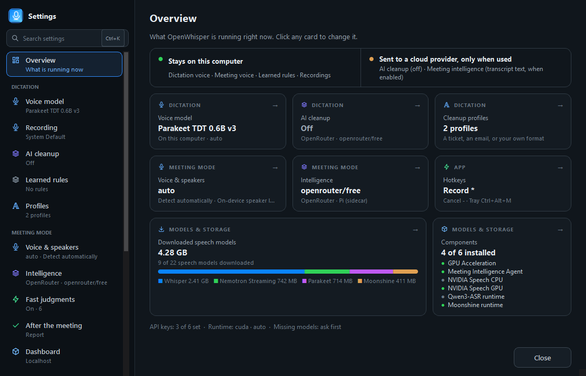
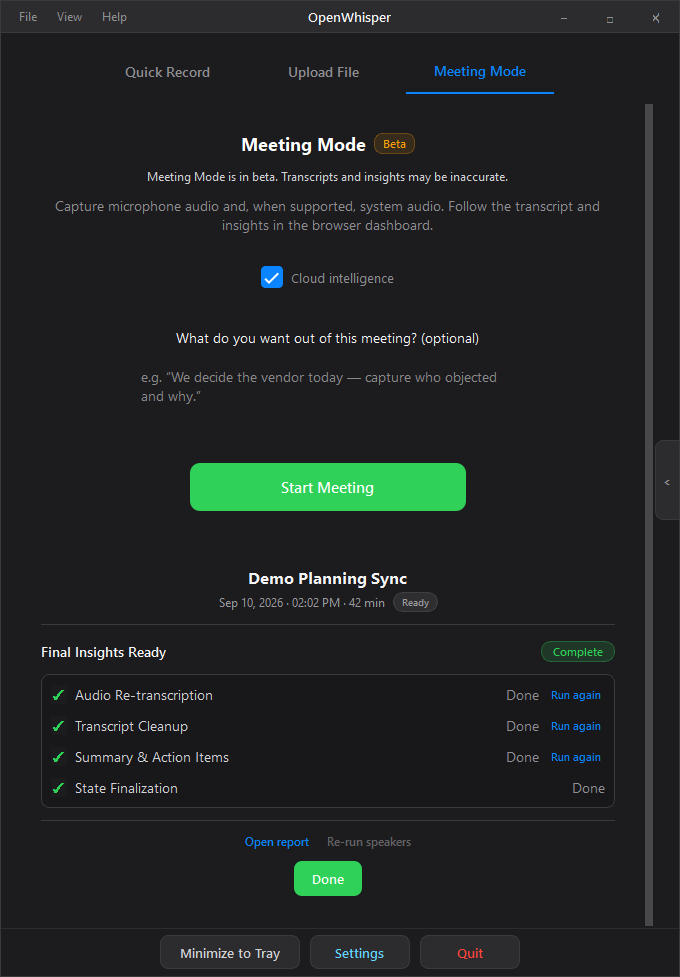
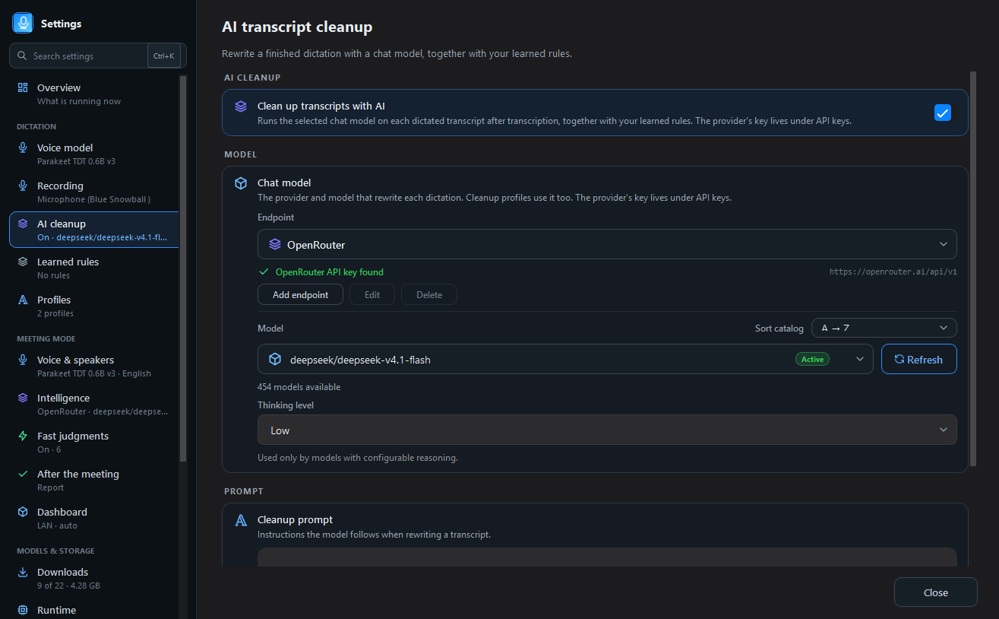

# OpenWhisper

A desktop app for dictation, audio-file transcription, and meeting notes on Windows, macOS, and Linux. Transcribe with local speech models or the OpenAI API, then optionally use AI to clean up the text.

[Website](https://openwhisper.fiorilabs.tech/) · [Download](https://github.com/Knuckles92/OpenWhisper/releases/latest) · [Run from source](#run-from-source) · [Install](#install) · [Changelog](CHANGELOG.md)

Use a [packaged release](#install) with bundled Python and dependencies, or [run from source](#run-from-source) using your own Python environment.

<p align="center">
  
</p>

<p align="center">
  
</p>

## What it does

- **Dictation:** Record from any app with a global hotkey, see a live preview on supported engines, and paste the result into the active window.
- **Audio files:** Transcribe one file or a queue, keep results separate or combine them, and copy the output when ready.
- **Meetings:** Capture microphone and system audio, follow a live dashboard, review searchable transcripts and AI insights, play recordings, and export. Available on Windows and macOS 13+; Linux system audio is a [preview](docs/linux-system-audio.md).
- **AI cleanup:** Apply spelling and style rules or reusable [cleanup profiles](docs/cleanup-profiles.md), with separate text-model choices for dictation and meetings.
- **One Settings window:** An Overview of what is running, each model choice on the page for the feature it powers, local models and runtimes under Downloads, and Ctrl+K search across every setting, model, and help note.
- **History:** Search, retranscribe, and export transcripts as Markdown, plain text, or JSON. See [export format support](docs/export-support.md) for what each format includes.

The app also includes microphone selection, a system tray where available, and dark, light, or system-matched themes.

## Install

Download the package for your platform from [Releases](https://github.com/Knuckles92/OpenWhisper/releases/latest). Native packages include Python and the app dependencies.

| Platform | Install |
| --- | --- |
| Windows | Run the `.exe` installer. It installs per-user without admin rights. |
| macOS | Open the `.dmg` and drag OpenWhisper into Applications. Requires Apple Silicon and macOS 14+. The preview is not notarized; approve first launch in **Privacy & Security → Open Anyway**. |
| Linux | Install the `.deb` on Debian 12+ / Ubuntu 22.04+, or `.pkg.tar.zst` on Arch-compatible distributions. Both packages require x86_64. |

On Linux, use the matching command, replacing `<version>` with your download's version:

```bash
sudo apt install "./OpenWhisper-<version>-linux-amd64.deb"
# or
sudo pacman -U "./OpenWhisper-<version>-linux-x86_64.pkg.tar.zst"
```

Launch from your app menu; Linux packages also provide `ow` and `openwhisper` commands.

Downloads include `SHA256SUMS.txt` for verification. Compare your file's hash using `Get-FileHash` in PowerShell, `shasum -a 256` on macOS, or `sha256sum` on Linux. The Windows installer is unsigned; if SmartScreen blocks it, verify the download before choosing **More info → Run anyway**.

### macOS permissions

Allow **Microphone** for recording, **Screen & System Audio Recording** for meeting system audio, and **Accessibility** for auto-paste under **System Settings → Privacy & Security**. Without Accessibility, you can still copy transcripts. **Settings → General → Set up auto-paste** shows the exact app to allow; if permission stops working after an update, remove its old entry, add that app again, and restart.

## Run from source

Run OpenWhisper directly from a source checkout on Windows, macOS, or Linux. You'll need **Git** and **Python 3.11 or 3.12**; the steps below install the app's dependencies in a virtual environment. This also supports Intel Macs and Linux distributions without native packages.

### One-time setup

Clone the repository and enter its folder:

```bash
git clone https://github.com/Knuckles92/OpenWhisper
cd OpenWhisper
```

Then create the virtual environment and install dependencies for your platform.

**Windows (PowerShell):**

```powershell
python -m venv venv
. .\venv\Scripts\Activate.ps1
python -m pip install -r requirements.txt
```

**macOS / Linux:**

```bash
python3 -m venv venv
source venv/bin/activate
python -m pip install -r requirements.txt
```

On Linux, install Python's venv and development packages and a C compiler if needed. The launcher checks audio and Qt system libraries and prints the package-manager command for any missing dependencies. Meeting capture also needs [PulseAudio or PipeWire-Pulse](docs/linux-system-audio.md).

### Launch the app

After setup, use these commands whenever you want to run OpenWhisper. Run them from your `OpenWhisper` checkout folder.

**Windows (PowerShell):**

```powershell
. .\venv\Scripts\Activate.ps1
python main.py
```

**macOS / Linux:**

```bash
./scripts/openwhisper
```

The macOS/Linux launcher selects the project's virtual environment automatically. On macOS, it also lets Accessibility setup identify the correct app bundle. After launch, follow [Get started](#get-started) to choose a model and microphone.

### Optional: launch from any terminal

To register `ow` and `openwhisper`, run `.\install.cmd` in PowerShell on Windows or `./install.sh` on macOS/Linux once from your checkout folder. Open a new terminal, then use `ow` or `openwhisper` from any folder without activating the virtual environment. See [source launchers](CONTRIBUTING.md#source-launchers) for details.

### Optional: develop with uv

Contributors can use `uv sync` and `uv run python main.py` without activating a virtual environment. See [development with uv](CONTRIBUTING.md#development-with-uv) for setup, tests, and NVIDIA GPU support. The pip instructions above and packaged releases do not require uv.

## GPU acceleration

For Local Whisper, install **GPU Acceleration** from **Downloads → Components** on Windows. Windows/Linux source installs can run `python -m pip install -r requirements-gpu.txt` in the activated virtual environment. Both need an NVIDIA driver providing CUDA 12 (525+); the CUDA Toolkit is not required. macOS uses CPU.

Other speech engines use their own runtimes from Downloads. The Meeting Intelligence Agent is also a separate component, available on Windows and Linux.

## Updates

Use **Help → Check for Updates**. Windows applies an in-app update or opens setup; macOS opens a verified DMG for replacement in Applications. On Linux, install the new package with the same command as above. Source users run `git pull --ff-only` and reinstall requirements if dependencies changed. Automatic checks and notifications are configurable in **Settings → General**.

## Get started

1. Open **Settings → Voice model** and choose a speech backend. New Windows x64 installs default to Parakeet; other platforms default to Local Whisper. Existing choices are preserved.
2. Download the selected model and any required runtime through **Settings → Downloads** (**Get models and runtimes** on the Voice model page opens it filtered to your engine), or add an OpenAI key in **Settings → API keys** for cloud transcription.
3. Choose your microphone in **Settings → Recording**. On macOS, grant the [required permissions](#macos-permissions).
4. Use **Quick Record** or the recording hotkey. Stop recording to transcribe; dictation follows your clipboard and auto-paste settings. **Upload File** results stay in the app and have Copy buttons.

For meetings, open **Meeting Mode**. Before starting, you can write an optional brief saying what you want out of the meeting — the AI note taker and the live copilot read it on every pass, so a request like "capture who objected to the vendor and why" is watched for as the meeting reaches it. The host can change it on the dashboard at any time. After local transcription finishes, **Continue in the background** lets you start another meeting while cleanup and reports finish; results remain in Past Meetings. Optional [insight review](docs/meeting-insight-review.md) uses TypeSafe to ask a few questions about uncertain commitments, owners, deadlines, or decisions; your answers update the insights and notes.

Optional [fast judgments](docs/typesafe-fast-judgments.md) add advisory citation checks, meaning-based history search, an open-question radar, and clickable highlight pulses. Enable them individually under **Meeting Mode → Fast judgments**. Spoken instructions also support recaps and reversible term corrections.

### Hotkeys

Change shortcuts and choose **Toggle** or **Push and hold** in **Settings → Hotkeys**. Toggle starts and stops recording with successive presses; push-and-hold records until you release the shortcut.

| Action | Windows / Linux | macOS |
| --- | --- | --- |
| Start/stop recording | Numpad `*` | `Control+Option+R` |
| Cancel | Numpad `-` | `Control+Option+Escape` |
| Enable/disable program | `Ctrl+Alt+Numpad *` | `Control+Option+Shift+R` |
| Minimize to tray | `Ctrl+Alt+M` | `Control+Option+M` |

On Linux, hotkeys also reach the focused app. Native Wayland limits global hotkeys and auto-paste; use in-app controls and clipboard copy, or an X11 session for those integrations. On macOS, auto-paste requires Accessibility permission; normal global hotkeys do not.

## Speech models

| Backend | Models | Platform / device | Workflows |
| --- | --- | --- | --- |
| Local Whisper | Standard Whisper sizes, turbo, Distil-Whisper | All platforms, CPU; NVIDIA CUDA on Windows/Linux | Dictation with preview, uploads, meetings |
| Parakeet | TDT 0.6B v3 | Windows x64 CPU / NVIDIA GPU; Apple Silicon CPU | Dictation with preview, uploads, meeting chunks |
| Qwen3-ASR | 0.6B, 1.7B | Windows x64 CPU / NVIDIA GPU | Dictation, uploads |
| Nemotron Streaming | 3.5 ASR Streaming 0.6B | Windows x64 CPU / NVIDIA GPU | Dictation with preview, uploads, meetings with native preview |
| Moonshine | Streaming Small / Medium, English | Windows x64 CPU | Dictation, uploads, meetings with native preview |
| OpenAI API | GPT-Transcribe, GPT-4o Transcribe, GPT-4o Mini Transcribe, Whisper | Cloud; API key and network required | Dictation, uploads |

Local model weights and optional runtimes are separate downloads. **Settings → Downloads** shows model details and required components, and verifies component archives before installation. macOS transcription uses CPU; see [GPU acceleration](#gpu-acceleration) for Windows and Linux.

### AI cleanup and meeting intelligence

Speech recognition and text processing use separate models. Choose the cleanup model on **Settings → AI cleanup** and the meeting model on **Settings → Intelligence**; each is set independently. Text providers include OpenAI, OpenRouter, Ollama, Groq, OpenCode Go/Zen, and custom OpenAI-compatible endpoints.

Add credentials in **Settings → API keys**; they are stored in the OS credential store. Environment variables or a `.env` file provide a fallback when no key is saved: `OPENAI_API_KEY`, `OPENROUTER_API_KEY`, `GROQ_API_KEY`, `OPENCODE_GO_API_KEY`, and `OPENCODE_ZEN_API_KEY`. Add custom endpoints from either chat-model picker. Ollama requires a separately managed server.

Enable cleanup in **Settings → AI cleanup**, teach spelling and style in **Learned rules**, and use [Profiles](docs/cleanup-profiles.md) for formats such as emails or support tickets. Meeting settings control intelligence, end-of-meeting processing, and dashboard sharing.

### Offline use

Downloaded speech models load from the local cache without network metadata checks. Install any required runtime before going offline.

**Settings → Downloads → When a model is missing from this computer** controls missing-model downloads: ask first (default), always allow, or never connect unless you approve a one-time override. Setting `HF_HUB_OFFLINE=1` before launch blocks model downloads entirely. This controls model downloads; cloud transcription and remote text providers still require a network connection.

<details>
<summary>More screenshots</summary>

<p align="center">
  
</p>

<p align="center">
  
</p>

<p align="center">
  
</p>

<p align="center">
  
</p>

<p align="center">
  
</p>

</details>

## Contributing and license

See [CONTRIBUTING.md](CONTRIBUTING.md) for development setup, validation, and backend changes. Release history lives in [CHANGELOG.md](CHANGELOG.md).

OpenWhisper builds on OpenAI Whisper, faster-whisper, NVIDIA NeMo-Speech.cpp, Qwen3-ASR, and Moonshine, with converted Whisper weights from Systran and Mobius Labs. The app source is [MIT licensed](LICENSE); model weights and dependencies retain their own licenses. See [Third-party notices](THIRD_PARTY_NOTICES.md).
