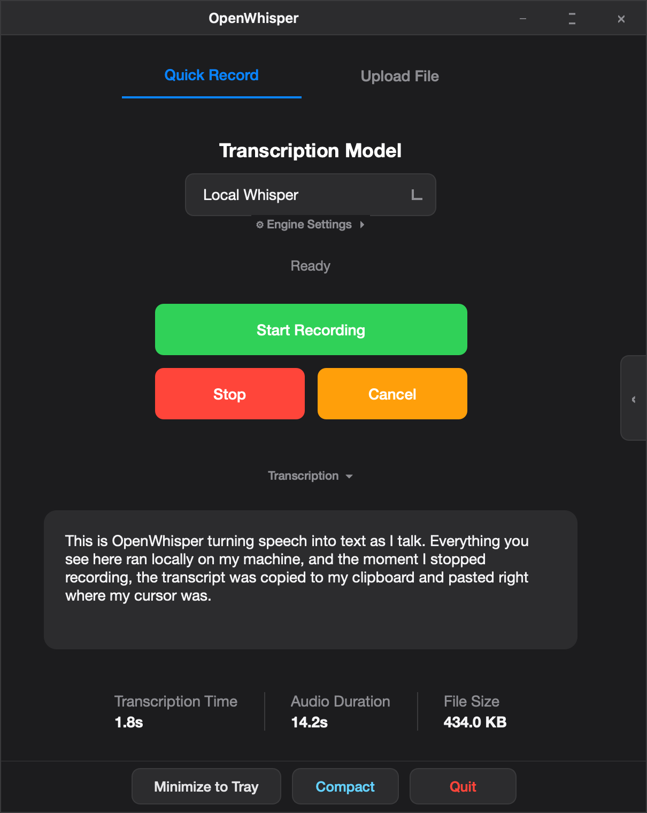
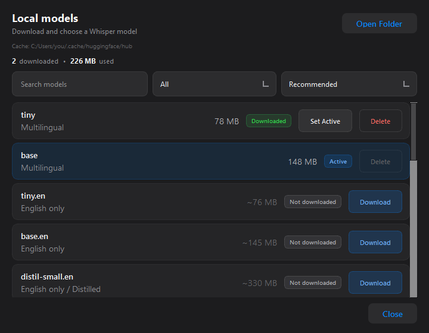

# OpenWhisper

**Website:** [openwhisper.fiorilabs.tech](https://openwhisper.fiorilabs.tech/)

A cross-platform desktop app (Windows, macOS, Linux) for recording audio and transcribing it to text using local Whisper models or OpenAI API. Features a modern PyQt6 GUI, system tray integration, global hotkeys, and auto-paste. The app detects your OS at runtime and adapts hotkey handling, auto-paste, and platform conventions automatically — see [Platform differences](#platform-differences).


<p align="center">
  
</p>

<p align="center">
  
</p>

<p align="center">
  
</p>


## Features

- **Local Whisper** – Runs offline with `faster-whisper`, using optimized Whisper models (~150MB download on first use)
- **Model Manager** – Manage voice and text models in one place: browse, download, and activate local Whisper models, or use a guided provider → model picker for OpenAI/OpenRouter cleanup models
- **API Options** – OpenAI Whisper API, GPT-4o Transcribe, GPT-4o Mini Transcribe
- **Global Hotkeys** – Start/stop recording from any app (customizable)
- **Auto-paste** – Transcription automatically pastes to your active window
- **System Tray** – Minimize to tray, always accessible
- **Smart Splitting(API)** – Large audio files split automatically to avoid API limits
- **Audio Device Selection** – Choose your preferred microphone input
- **Transcription History** – Browse past transcriptions with search/filter, retranscribe recordings
- **Audio Upload** – Import existing audio files for transcription
- **Real-time Visualization** – Animated waveform overlay shows recording status
- **Live Streaming** – Real-time transcription preview while recording
- **Window Memory** – Remembers window position and size between sessions

## Platform differences

The same codebase runs on all three platforms; a few behaviors adapt to the OS:

| Area | Windows | macOS | Linux |
|------|---------|-------|-------|
| Global hotkeys | `keyboard` library (per-key suppression) | Carbon `RegisterEventHotKey` (no Accessibility permission; falls back to [`pynput`](https://pypi.org/project/pynput/) if registration fails) | `pynput` (observe-only) |
| Default hotkeys | Numpad (`*`, `-`, `Ctrl+Alt+*`) | Control+Option (`⌃⌥R`, `⌃⌥⎋`, `⌃⌥⇧R`) | Numpad (same as Windows) |
| Auto-paste | `Ctrl+V` | `Cmd+V` | `Ctrl+V` |
| Caret paste indicator | Tracks the real text caret (Win32 API) | Follows the mouse cursor (no public caret API) | Follows the mouse cursor |
| GPU | CUDA (NVIDIA) — downloadable component or pip wheels | CPU only (no Metal/MPS in faster-whisper) | CUDA (NVIDIA) — pip wheels |
| Launchers | `.cmd` + PowerShell, `pythonw.exe` | `install.sh` + shell scripts | `install.sh` + shell scripts |

> On Linux, `pynput` cannot selectively swallow individual key events, so hotkey combinations also reach the focused app. On macOS, Carbon hotkeys are registered with the OS (like VS Code or Slack) and do not require Accessibility permission; if Carbon registration fails, the app falls back to `pynput` and combos may leak to the focused app. The Control+Option defaults on macOS avoid clashing with Spotlight, 1Password, and other common shortcuts.

## GPU Acceleration (Windows / Linux)

**Prerequisite (both platforms):** an NVIDIA driver providing CUDA 12 — version 525 or newer. The driver supplies `nvcuda.dll` / `libcuda.so.1` and never comes from pip. **You do not need the CUDA Toolkit installer.**

> **Installer builds:** the Windows installer ships CPU transcription only, which keeps the download under 90 MB. NVIDIA GPU acceleration is an optional ~633 MB download (959 MB installed) from **Manage models → Components** inside the app. OpenWhisper verifies every download by SHA-256 and preserves an existing working CUDA setup during upgrades.

Running **from source**, install the CUDA libraries faster-whisper's engine (CTranslate2) loads at runtime:

```bash
pip install -r requirements-gpu.txt
```

That pulls cuBLAS plus NVRTC and the CUDA 12 runtime — roughly 630 MB of wheels on Windows, a little more on Linux, and under 1 GB once installed. (The component figures above are smaller because the component extracts only the DLLs, not the whole wheels.) CPU-only users should skip this file; transcription works fine without it. macOS users should skip it too: faster-whisper has no Metal/MPS backend, so transcription runs on CPU there.

**cuDNN is deliberately not installed.** CTranslate2 4.8 has no import-table entry and no `LoadLibrary`/`dlopen` name string for cuDNN on either platform, and a GPU transcription with cuDNN fully removed loads zero cuDNN modules — so the `nvidia-cudnn-cu12` wheel (737 MB on Windows, 799 MB on Linux) would be pure download weight.

How the libraries get found differs by platform, because Linux has no mutable equivalent of the Windows DLL search path:

| Platform | Mechanism |
|----------|-----------|
| Windows | `app_qt._register_cuda_dll_directories()` registers the wheels' `bin` directories with `os.add_dll_directory` **and** prepends them to `PATH` — both are needed, because CTranslate2's loader ignores the former |
| Linux | `app_qt._preload_cuda_libraries()` loads the `.so` files with `RTLD_GLOBAL` before the model loads, so CTranslate2's later `dlopen("libcublas.so.12")` resolves to the already-loaded object. `LD_LIBRARY_PATH` is read by `ld.so` at process start and cannot be changed from inside a running process; `scripts/openwhisper` also exports it for good measure |

Either way, no PATH editing and no CUDA Toolkit. GPU auto-detection uses CTranslate2 directly, so **torch is not required**. With `device: auto`, the app detects the GPU and selects optimal settings (turbo model + float16 on GPU, base + int8 on CPU). If a GPU is detected but its libraries cannot be loaded, the model falls back to CPU with a warning in `openwhisper.log` rather than failing.

**Older GPUs (Pascal and earlier):** CTranslate2 does not support `float16` there, so `auto` falls back to `int8_float32` rather than `float32`. This matters more than it sounds: measured on a 4 GB GTX 1050 Ti, the auto-selected turbo model peaked at **3957/4096 MiB and ran out of memory** at `float32`, versus **1377 MiB with headroom to spare** at `int8_float32`. Turbo runs on the GPU on a 4 GB card as a result, and cold start dropped from ~113 s to ~27 s. Cards that support `float16` never reach this fallback and are unaffected. Verified with driver 580 / CUDA 13 — a newer driver than the CUDA 12 wheels, which is fine.

With CUDA enabled, faster-whisper runs 2-4x faster than CPU-only. Streaming transcription uses ~15-20% GPU vs 40-60% CPU.

## Installation

### Windows — installer (recommended)

Download **OpenWhisper-Setup-2.1.1.exe** from [openwhisper.fiorilabs.tech](https://openwhisper.fiorilabs.tech/) or the [Releases page](https://github.com/Knuckles92/OpenWhisper/releases), then run it.

- No Python, no admin rights, no UAC prompt — it installs per-user to `%LOCALAPPDATA%\Programs\OpenWhisper`.
- Settings, history, and recordings live in `%LOCALAPPDATA%\OpenWhisper` and are kept if you reinstall.
- A speech model (~150 MB) downloads on first use, with a consent prompt.

> **SmartScreen warning:** the installer is not yet code-signed, so Windows shows *"Windows protected your PC"*. Click **More info → Run anyway**. Verify the download by comparing its SHA-256 against the checksum published next to the download link:
> ```powershell
> Get-FileHash .\OpenWhisper-Setup-2.1.1.exe -Algorithm SHA256
> ```

To uninstall, use *Settings → Apps → Installed apps*. You'll be asked whether to keep your settings and history.

### Install from source (all platforms)

Use this for macOS and Linux, for development, or for NVIDIA GPU acceleration.

**Python:** 3.11–3.12 recommended (3.11 verified; 3.12 stable). 3.13 works, but on Debian/Ubuntu you need `python3-dev` and a compiler because `pynput` → `evdev` has no prebuilt wheel for 3.13 yet.

**Note:** Use a virtual environment (venv) to avoid package version conflicts.

On a minimal **Debian / Ubuntu / Pop!_OS** install, install Python and the system libraries PyQt6 and `sounddevice` need before creating the venv. On a fresh box, run `apt update` first:

```bash
sudo apt update
sudo apt install -y \
  python3 python3-venv python3-dev build-essential \
  libportaudio2 libegl1 libxcb-cursor0 libxkbcommon-x11-0 \
  libxcb-icccm4 libxcb-keysyms1 libxcb-xkb1
```

`libportaudio2` backs `sounddevice` (recording). The Qt/XCB packages cover EGL, cursor, keyboard, and ICCCM support — without them the app can fail at import with missing `libEGL.so.1` or with *"no Qt platform plugin could be initialized"*.

**Fedora / RHEL:**

```bash
sudo dnf install -y \
  python3 python3-devel gcc portaudio \
  xcb-util-cursor xcb-util-keysyms xcb-util-wm \
  libxkbcommon-x11 mesa-libEGL
```

**Arch Linux:**

```bash
sudo pacman -S --needed \
  python python-pip base-devel portaudio \
  xcb-util-cursor xcb-util-keysyms xcb-util-wm \
  libxkbcommon libgl
```

```bash
git clone https://github.com/Knuckles92/OpenWhisper
cd OpenWhisper
# Windows
python -m venv venv
venv\Scripts\activate
# macOS / Linux
python3 -m venv venv
source venv/bin/activate
pip install -r requirements.txt
```

### Building the installer yourself

```powershell
.\venv\Scripts\activate
pip install -r requirements.txt -r requirements-build.txt
winget install -e --id JRSoftware.InnoSetup
.\scripts\build_installer.ps1 -Clean
```

The result lands in `installer\Output\`. See [`OpenWhisper.spec`](OpenWhisper.spec) for what is and isn't bundled.

### Updating the GPU component

The installer ships CPU-only; the CUDA runtime is a downloadable component. **Nothing is hosted for it** — the catalog lives in `services/components.py` and points straight at PyPI, whose published wheels are immutable, and every download's SHA-256 is verified before extraction.

To move to newer CUDA wheels, bump the pins in `requirements-gpu.txt`, then:

```powershell
python scripts\build_component.py gpu-accel
```

That resolves what pip would install for `win_amd64`, records the SHA-256 pip reports for each wheel, downloads them to measure the extracted payload, and prints a ready-to-paste `_BUILTIN_GPU_ARCHIVES` block plus the matching `install_bytes`. Paste both into `services/components.py` and bump `GPU_COMPONENT_VERSION` so existing installs are offered the new payload.

Two things not to skip: `install_bytes` drives the pre-install free-space check, so it must be the measured value the script prints rather than an estimate; and `GPU_COMPONENT_VERSION` is what the Model Manager compares against an installed manifest, so leaving it unchanged means nobody is told an update exists.

OPTIONAL: For cloud transcription, set your API key:
```bash
# Windows
set OPENAI_API_KEY=your-key

# macOS / Linux
export OPENAI_API_KEY=your-key

# Or create a .env file
OPENAI_API_KEY=your-key
```

## Required macOS permissions

macOS gates some features behind privacy permissions. Grant these to the app identity that is actually running OpenWhisper:

- **Microphone** — needed to record audio (System Settings > Privacy & Security > Microphone). You'll be prompted on first recording.
- **Accessibility** — needed only for **auto-paste** (the synthetic `Cmd+V` that inserts transcription into the focused app). Without it, transcriptions are still copied to the clipboard and you can paste manually. Global hotkeys work without Accessibility (Carbon `RegisterEventHotKey`).
- **Input Monitoring** *(optional)* — may be required when **remapping hotkeys** in Settings > Hotkeys (the capture dialog uses a `pynput` listener). Normal hotkey use does not need this.

For packaged builds, this should appear as the OpenWhisper app. For development launches from a virtualenv, use `scripts/openwhisper` or `ow`; on macOS the launcher runs through the framework `Python.app` so Accessibility has an app bundle it can select. If the list does not populate automatically, use the `+` button in Accessibility and add the app bundle shown in OpenWhisper's startup prompt, then fully quit and relaunch the app.

Do not add `venv/bin/python` manually if macOS greys it out in the picker. That path is usually a virtualenv symlink, and newer macOS pickers often only allow selecting app bundles from this dialog.

If auto-paste silently does nothing, Accessibility is still missing for the current launch identity. If hotkey capture in Settings fails, add Input Monitoring as well.

## Quick Launch (Windows)

For everyday use, you can register `ow` and `openwhisper` as global commands so the app launches from any terminal in any directory — no need to `cd` into the repo or activate the venv first.

### One-time install

From the repo root, run:

```
install.cmd
```

This adds `scripts\` to your user PATH (via the registry, not `setx` — see note below). It's idempotent, so running it twice does nothing the second time. **Open a new terminal afterward** for the change to take effect.

After install, both commands work from anywhere:

```
ow              # short alias
openwhisper     # full name
```

The launcher invokes `venv\Scripts\pythonw.exe` directly, so the app always uses the project's venv regardless of which environment your shell has activated. Code changes are picked up live — no reinstall needed after `git pull`.

### Uninstall

```
uninstall.cmd
```

Removes the PATH entry only. Your venv, code, and the `scripts/` folder are left untouched, so re-running `install.cmd` later will restore the commands.

### Manual install (no scripts)

If you can't or don't want to run the installer (e.g., corporate execution-policy restrictions), add the path yourself in PowerShell:

```powershell
$dir = "D:\path\to\OpenWhisper\scripts"   # <-- adjust to your clone location
$current = [Environment]::GetEnvironmentVariable("Path", "User")
if ($current -split ";" -notcontains $dir) {
    [Environment]::SetEnvironmentVariable("Path", "$current;$dir", "User")
}
```

> **Why not `setx`?** `setx PATH ...` from a `.cmd` file silently truncates PATH at 1024 characters and can duplicate System PATH entries into User PATH. `install.cmd` shells out to PowerShell, which writes directly to `HKCU\Environment\Path` via `[Environment]::SetEnvironmentVariable` — no truncation, no leakage between User and System scopes.

### Alternative: skip PATH editing

If you'd rather not modify your PATH at all, drop a copy of [scripts/openwhisper.cmd](scripts/openwhisper.cmd) into `%LOCALAPPDATA%\Microsoft\WindowsApps\` (which is already on Windows PATH for every user). Caveat: this is a *copy*, so you'd need to refresh it whenever the launcher logic changes — which is rare, but worth knowing.

## Quick Launch (macOS / Linux)

Register `ow` and `openwhisper` as global commands so the app launches from any terminal. From the repo root:

```bash
./install.sh
```

This adds the `scripts/` folder to your `PATH` in your shell profile files (`~/.bashrc`, `~/.zprofile`, and on macOS also `~/.bash_profile`; fish users get `~/.config/fish/config.fish`). It is idempotent. The installer prints the exact `source …` command for your shell — run that in your current terminal, or open a new one, then run:

```bash
ow              # short alias
openwhisper     # full name
```

The launcher invokes `venv/bin/python` directly, so the app always uses the project's venv. Code changes are picked up live — no reinstall needed after `git pull`. To remove the PATH entry, run `./uninstall.sh` (your venv, code, and `scripts/` folder are left untouched).

## Usage

If you registered the launcher, just type `ow` or `openwhisper` from any terminal. Otherwise:

```bash
# macOS / Linux
python3 app_qt.py
# Windows
python app_qt.py
```

### Hotkeys

Default hotkeys depend on your platform (all remappable in **Settings > Hotkeys**):

| Action | Windows / Linux | macOS |
|--------|-----------------|-------|
| Start/stop recording | `*` (numpad) | `⌃⌥R` |
| Cancel | `-` (numpad) | `⌃⌥⎋` |
| Enable/disable program | `Ctrl+Alt+*` | `⌃⌥⇧R` |
| Minimize to tray | `Ctrl+Alt+M` | `⌃⌥M` |

On macOS, supported modifiers are `⌘` (Command), `⌃` (Control), `⌥` (Option), `⇧` (Shift).

## Settings

Access settings via **File > Settings** or the system tray menu. Available options:

**General:** Default model, auto-paste, clipboard copy, minimize to tray, streaming transcription (experimental)

**Audio:** Sample rate, channels, silence threshold, input device selection

**Hotkeys:** Customize all keyboard shortcuts

**Advanced:** Whisper model selection (14+ options), compute device (auto/cuda/cpu), compute type (float16/float32/int8), max file size before splitting, streaming overlay positioning, logging, Hugging Face download policy

## Offline Usage and Model Downloads

Model loading is **cache-first**: models already on your computer always load locally, with no Hugging Face network checks — not even a metadata call. Hugging Face is contacted only when a model you request is missing from the local cache, and only with your consent.

The download policy lives in **Settings → Advanced → Hugging Face Downloads**:

- **Ask before downloading** (default): a consent dialog appears when a missing model is needed, showing the model, its Hugging Face repository, and an approximate download size. You can approve just that download ("Download once") or switch to always allowing downloads.
- **Always allow downloads**: missing models download without prompting. Cached models are still never re-checked for updates.
- **Never connect (fully offline)**: no downloads unless you explicitly approve a one-time override in the dialog.

Setting `HF_HUB_OFFLINE=1` in the environment before launching is a hard override that disables downloads entirely (still supported for scripts and CI):

```bash
export HF_HUB_OFFLINE=1
python3 app_qt.py
```

```powershell
set HF_HUB_OFFLINE=1
python app_qt.py
```

Upgrading from an older version: the previous **Skip HuggingFace network checks** toggle migrates automatically — enabled becomes **Never connect**, disabled becomes **Ask before downloading**.
## Requirements

- Python 3.11–3.12 recommended; 3.13 supported (needs `python3-dev` on Debian/Ubuntu for `evdev`)
- Windows, macOS, or Linux

**Note:** The caret paste indicator tracks the real text caret only on Windows (uses the Win32 API). On macOS and Linux it follows the mouse cursor, since there is no public caret-position API.

## Credits

OpenWhisper builds on these projects:

- [OpenAI Whisper](https://github.com/openai/whisper) – the original speech recognition models
- [faster-whisper](https://github.com/SYSTRAN/faster-whisper) – a CTranslate2-based reimplementation used for local transcription
- [Systran models on Hugging Face](https://huggingface.co/Systran) – converted Whisper and Distil-Whisper weights for most local models
- [Mobius Labs models on Hugging Face](https://huggingface.co/mobiuslabsgmbh) – turbo model weights (`faster-whisper-large-v3-turbo`)

## License

MIT License. Free to use, clone, and modify.
