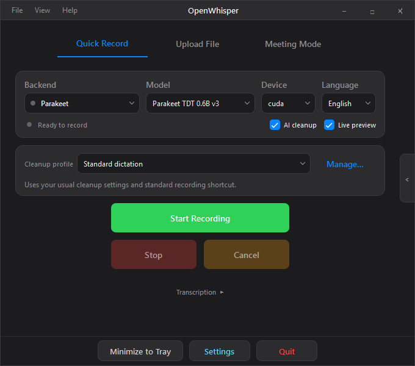
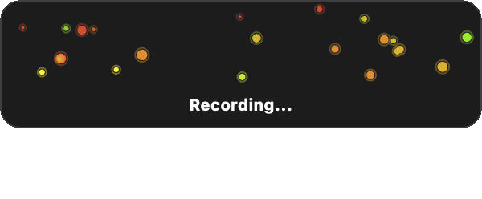
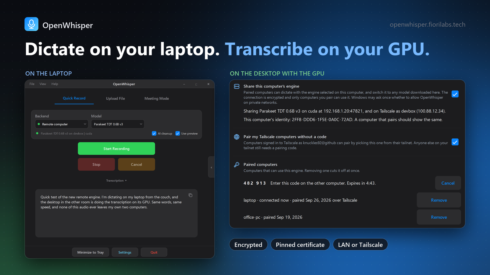
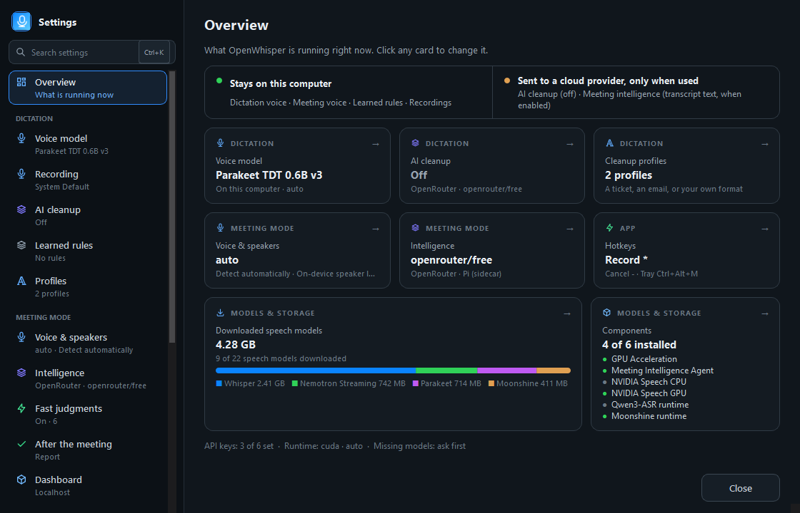
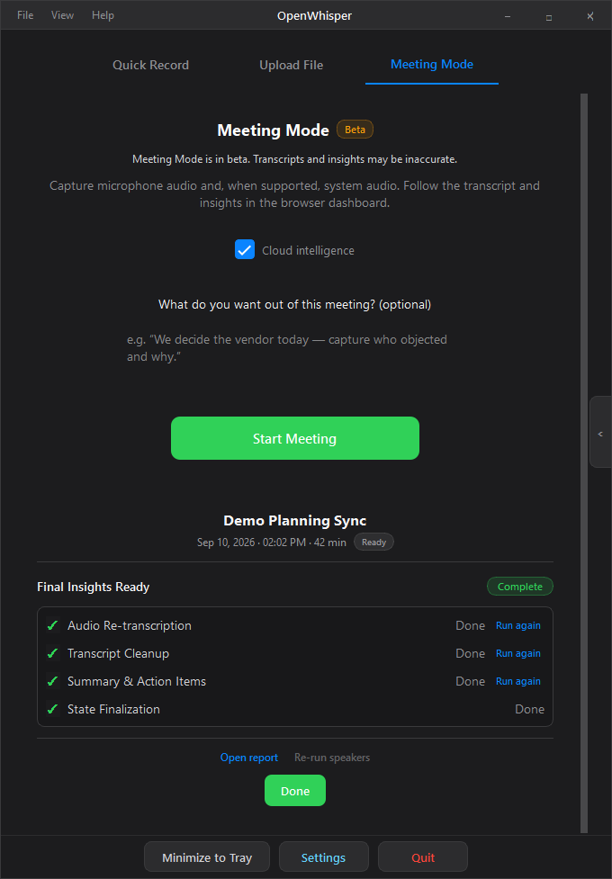
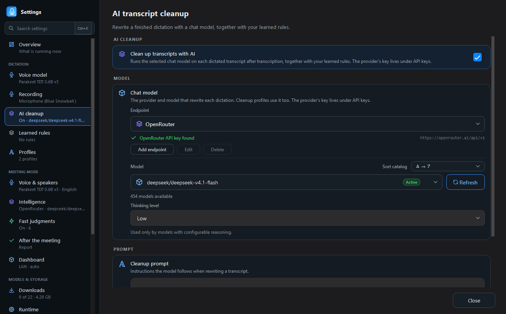
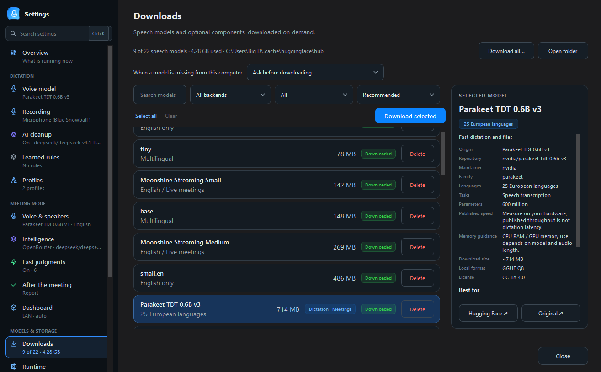
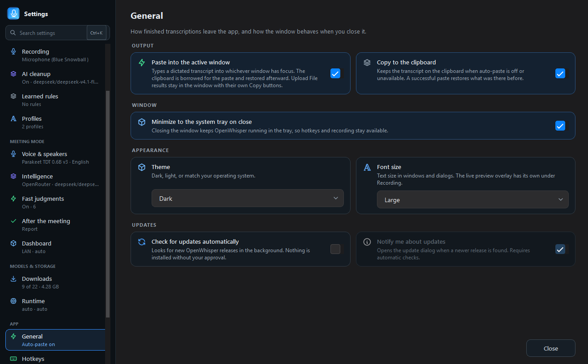

# OpenWhisper

A desktop app for dictation, audio-file transcription, and meeting notes on Windows, macOS, and Linux. Transcribe with local speech models or the OpenAI API, then optionally use AI to clean up the text.

[Website](https://openwhisper.fiorilabs.tech/) · [Download](https://github.com/Knuckles92/OpenWhisper/releases/latest) · [Run from source](#run-from-source) · [Install](#install) · [Changelog](CHANGELOG.md)

Use a [packaged release](#install) with bundled Python and dependencies, or [run from source](#run-from-source) using your own Python environment.

<p align="center">
  
</p>

<p align="center">
  
</p>

<p align="center">
  
</p>

## What it does

- **Dictation:** Record from any app with a global hotkey, see a live preview on supported engines, and paste the result into the active window.
- **Audio files:** Transcribe one file or a queue, keep results separate or combine them, and copy the output when ready.
- **Meetings:** Capture microphone and system audio, follow a live dashboard, review searchable transcripts and AI insights, play recordings, and export. Available on Windows and macOS 13+; Linux system audio is a [preview](docs/linux-system-audio.md).
- **AI cleanup:** Apply spelling and style rules or reusable [cleanup profiles](docs/cleanup-profiles.md), with separate text-model choices for dictation and meetings.
- **Settings:** Choose models, manage downloads, and find settings with Ctrl+K search.
- **History:** Search, retranscribe, and export transcripts as Markdown, plain text, or JSON. See [export format support](docs/export-support.md) for what each format includes.
- **Agent history API (preview):** Search saved transcripts and meeting notes through an opt-in, authenticated local API. See [API setup](docs/agent-api.md).
- **MCP:** Enable **Settings → MCP** to connect an agent to history, transcripts, and meeting insights. Optionally allow retitling and choose which settings agents may change. See [MCP setup](docs/mcp.md).

The app also includes microphone selection, a system tray where available, and dark, light, or system-matched themes.

## Install

Download the package for your platform from [Releases](https://github.com/Knuckles92/OpenWhisper/releases/latest). Native packages include Python and the app dependencies.

| Platform | Install |
| --- | --- |
| Windows | Run the `.exe` installer. It installs per-user without admin rights. |
| macOS | Open the `.dmg` and drag OpenWhisper into Applications. Requires Apple Silicon and macOS 14+. The preview is not notarized; approve first launch in **Privacy & Security → Open Anyway**. |
| Linux | Install the `.deb` on Debian 12+ / Ubuntu 22.04+, or `.pkg.tar.zst` on Arch-compatible distributions. Both packages require x86_64. |

On Linux, use the matching command, replacing `<version>` with your download's version:

```bash
sudo apt install "./OpenWhisper-<version>-linux-amd64.deb"
# or
sudo pacman -U "./OpenWhisper-<version>-linux-x86_64.pkg.tar.zst"
```

Launch from your app menu; Linux packages also provide `ow` and `openwhisper` commands.

Downloads include `SHA256SUMS.txt` for verification. Compare your file's hash using `Get-FileHash` in PowerShell, `shasum -a 256` on macOS, or `sha256sum` on Linux. The Windows installer is unsigned; if SmartScreen blocks it, verify the download before choosing **More info → Run anyway**.

### macOS permissions

In **System Settings → Privacy & Security**, allow **Microphone** for recording, **Screen & System Audio Recording** for meeting audio, and **Accessibility** for auto-paste. You can copy transcripts without Accessibility.

**Settings → General → Set up auto-paste** shows which app to allow. If permission breaks after an update, remove its old entry, add the app again, and restart.

## Run from source

You'll need **Git** and **Python 3.11 or 3.12**. Source installs support Windows, macOS (including Intel Macs), and Linux distributions without native packages.

### One-time setup

Clone the repository and enter its folder:

```bash
git clone https://github.com/Knuckles92/OpenWhisper
cd OpenWhisper
```

Then create the virtual environment and install dependencies for your platform.

**Windows (PowerShell):**

```powershell
python -m venv venv
. .\venv\Scripts\Activate.ps1
python -m pip install -r requirements.txt
```

**macOS / Linux:**

```bash
python3 -m venv venv
source venv/bin/activate
python -m pip install -r requirements.txt
```

On Linux, install Python's venv and development packages and a C compiler if needed. The launcher checks audio and Qt system libraries and prints the package-manager command for any missing dependencies. Meeting capture also needs [PulseAudio or PipeWire-Pulse](docs/linux-system-audio.md).

### Launch the app

Run these commands from your `OpenWhisper` checkout folder:

**Windows (PowerShell):**

```powershell
. .\venv\Scripts\Activate.ps1
python main.py
```

**macOS / Linux:**

```bash
./scripts/openwhisper
```

The macOS/Linux launcher selects the virtual environment and handles macOS app-bundle identification for Accessibility. Then follow [Get started](#get-started).

### Optional: launch from any terminal

To register `ow` and `openwhisper`, run `.\install.cmd` in PowerShell on Windows or `./install.sh` on macOS/Linux once from your checkout folder. Open a new terminal, then use `ow` or `openwhisper` from any folder without activating the virtual environment. See [source launchers](CONTRIBUTING.md#source-launchers) for details.

### Optional: develop with uv

Contributors can use `uv sync` and `uv run python main.py`. See [development with uv](CONTRIBUTING.md#development-with-uv) for setup, tests, and GPU support.

## GPU acceleration

For Local Whisper on Windows or Linux x86_64, install **GPU Acceleration** from **Downloads → Components**, or choose **Use this GPU** when prompted. Requires an NVIDIA driver providing CUDA 12 (525+); the CUDA Toolkit is not needed. macOS uses CPU.

Source installs can use `python -m pip install -r requirements-gpu.txt` in the activated virtual environment. **Auto** selects a compatible compute type; **Downloads** shows GPU memory estimates.

Other speech engines use their own runtimes from Downloads. The Meeting Intelligence Agent is also a separate component, available on Windows and Linux.

## Updates

Use **Help → Check for Updates**. Windows applies an in-app update or opens setup; macOS opens a verified DMG for replacement in Applications. On Linux, install the new package with the same command as above. Source users run `git pull --ff-only` and reinstall requirements if dependencies changed. Automatic checks and notifications are configurable in **Settings → General**.

## Get started

1. Open **Settings → Voice model** and choose a speech backend. New Windows x64 installs default to Parakeet; other platforms default to Local Whisper. Existing choices are preserved.
2. Download the model and runtime through **Settings → Downloads**, or add an OpenAI key in **Settings → API keys** for cloud transcription.
3. Choose your microphone in **Settings → Recording**. On macOS, grant the [required permissions](#macos-permissions).
4. Use **Quick Record** or the recording hotkey. Stop recording to transcribe; dictation follows your clipboard and auto-paste settings. **Upload File** results stay in the app and have Copy buttons.

For meetings, open **Meeting Mode**. Add an optional brief to guide AI notes and the live copilot; you can edit it during the meeting. After transcription, **Continue in the background** lets you start another meeting while reports finish. Find results in **Past Meetings**.

Optional [insight review](docs/meeting-insight-review.md) helps clarify uncertain decisions and commitments. [Fast judgments](docs/typesafe-fast-judgments.md) add citation checks, meaning-based history search, and live meeting cues; enable them under **Meeting Mode → Fast judgments**.

### Hotkeys

Change shortcuts and choose **Toggle** or **Push and hold** in **Settings → Hotkeys**. Toggle starts and stops recording with successive presses; push-and-hold records until you release the shortcut.

| Action | Windows / Linux | macOS |
| --- | --- | --- |
| Start/stop recording | Numpad `*` | `Control+Option+R` |
| Cancel | Numpad `-` | `Control+Option+Escape` |
| Enable/disable program | `Ctrl+Alt+Numpad *` | `Control+Option+Shift+R` |
| Minimize to tray | `Ctrl+Alt+M` | `Control+Option+M` |

On X11 Linux, hotkeys also reach the focused app. Omarchy supports desktop shortcuts and auto-paste; other native Wayland desktops use focused-window shortcuts and manual paste. macOS auto-paste requires Accessibility permission; global hotkeys do not.

### Omarchy / Hyprland

OpenWhisper adapts to Omarchy 3 and 4 with a compact interface and desktop colors. Hyprland manages window placement and sizing; Omarchy mode supports desktop shortcuts and auto-paste on Hyprland 0.55+.

Choose **Settings → General → Theme → Omarchy desktop** to follow your desktop palette. An optional [Omarchy 4 bar widget](integrations/omarchy) provides recording controls, status, and live text.

## Speech models

| Backend | Models | Platform / device | Workflows |
| --- | --- | --- | --- |
| Local Whisper | Standard Whisper sizes, turbo, Distil-Whisper | All platforms, CPU; NVIDIA CUDA on Windows/Linux | Dictation with preview, uploads, meetings |
| Parakeet | TDT 0.6B v3; Orukeet TDT 0.6B community adaptation | Windows x64 and Linux x86_64 CPU / NVIDIA GPU; Apple Silicon CPU | Dictation with preview, uploads, meeting chunks |
| Parakeet MLX | TDT 0.6B v3, MLX Community weights | Apple Silicon, macOS 14+: Apple GPU through Metal or CPU | Dictation with preview, uploads, meeting chunks |
| Qwen3-ASR | 0.6B, 1.7B | Windows x64 CPU / NVIDIA GPU | Dictation, uploads |
| Nemotron Streaming | 3.5 ASR Streaming 0.6B | Windows x64 and Linux x86_64 CPU / NVIDIA GPU | Dictation with preview, uploads, meetings with native preview |
| Moonshine | Streaming Small / Medium, English | Windows x64 CPU | Dictation, uploads, meetings with native preview |
| OpenAI API | GPT-Transcribe; GPT-4o Transcribe, GPT-4o Mini Transcribe, and Whisper until OpenAI retires them on February 26, 2027 | Cloud; API key and network required | Dictation, uploads |
| Remote computer | Whichever engine the paired computer has selected | Another computer running OpenWhisper on your network | Dictation with that engine's preview, uploads, meetings with a supported host model |

Optional local engines offer English, Russian, Spanish, French, Portuguese, Mandarin, and Auto where supported. Parakeet and Orukeet omit Mandarin; Moonshine offers English only. Qwen supports all these presets; Nemotron includes Mandarin in its broader coverage tier, where accuracy may vary. Auto detects other languages supported by the model. These controls transcribe speech rather than translate it. Paired computers expose the same host-supported choices.

Local model weights and optional runtimes are separate downloads. **Settings → Downloads** shows model details and required components, and verifies component archives before installation. On Apple Silicon Macs, select **Parakeet MLX**, download its runtime and model, and choose **Auto** to use the Apple GPU through Metal, or **CPU** to use the processor. This is an experimental integration; actual Apple Silicon transcription validation is pending. The MLX weights download is about 2.5 GB. Local Whisper and the GGUF Parakeet option use CPU on macOS; see [GPU acceleration](#gpu-acceleration) for Windows and Linux.

Orukeet is an optional 25-language adaptation of NVIDIA Parakeet from Oruk AI,
including Russian and English. Its r3 native Q8 download is 714 MB and uses the
existing NVIDIA Speech runtime. Tested with the pinned Windows and Linux CPU/CUDA
runtimes; Apple Silicon validation for Orukeet is pending. It remains a community model; evaluate it on
your recordings. Its weights are CC BY-SA 4.0, with attribution and applicable
ShareAlike terms; see [the publisher's notice](https://huggingface.co/oruk/orukeet/blob/main/NOTICE.md).

Downloads shows the publisher, source host, license, selected version, and download
checks. Optional ASR weights and runtime archives are pinned by version, size, and
SHA-256. Built-in Whisper aliases use pinned Hugging Face commits; custom sources
retain their publisher-selected version. Integrity checks do not guarantee model
or runtime security. Keep OpenWhisper and its runtimes updated, and review important
transcripts for errors. Local transcription runs on this computer after installation;
downloading connects to the listed host. Cloud transcription, remote engines, and
AI cleanup have their own network behavior.

### Custom Whisper models

Choose **Add custom models…** in **Settings → Downloads**, **Dictation → Voice model**, or **Meeting Mode → Voice & speakers**.

- **Local files:** Choose a model folder or a parent folder containing several models. OpenWhisper lists complete model folders for you to select.
- **Hugging Face:** Enter an `owner/model` repository and, optionally, a subfolder such as `ct2_int8_float16`. **Find on Hugging Face** lists compatible model folders without downloading weights. You can also discover models already in the local Hugging Face cache.

Select the models you want and click **Add selected**, then choose one in **Voice model** or **Voice & speakers** to load it. Downloads follow your existing Hugging Face policy; cached models load offline. Custom folders must contain a CTranslate2 Whisper `model.bin`, valid `config.json`, and `tokenizer.json`. Original PyTorch weights need conversion before use. Removing a custom entry keeps its source files.

### Remote engine

Use another computer's OpenWhisper engine for dictation, uploads, or meetings:

1. On the computer with the engine, open **Settings → Dictation → Remote engine**, turn on **Share this computer's engine**, and click **Pair a device**. Allow OpenWhisper through the firewall if Windows asks.
2. On the other computer, open the same page, enter the host's address (shown under the switch) and the six-digit code, and click **Pair**. Check that both screens show the same identity code.
3. Click **Use for dictation**, or choose **Remote computer** as the recording engine.

The host's selected engine handles transcription. Traffic is encrypted and limited to paired computers; remove access under **Paired computers**.

- **Meetings:** Select **Remote computer** in **Settings → Meeting Mode → Voice & speakers → Speech engine**. Audio goes to the host for transcription; capture, recordings, and transcripts stay on the computer running the meeting.
- **Host models:** Use **Manage host models** to choose or download a model and install speech runtimes. The host must first enable **Allow paired computers to manage models**.
- **History through the host's MCP:** Enable **Allow the paired host to query this computer's history** on the client to let agents search its saved transcripts and meetings while it is online. Agents use `include_clients`; choose **Both** storage to keep host copies available while this computer is offline. See [direct client queries](docs/mcp.md#query-paired-clients-directly).
- **Away from home:** Install [Tailscale](https://tailscale.com/download) on both computers. Hosts on your tailnet appear in the app; computers on the same Tailscale account can connect without a pairing code when the host allows it.

### AI cleanup and meeting intelligence

Choose separate text models in **Settings → AI cleanup** and **Settings → Intelligence**. Providers include OpenAI, OpenRouter, Ollama, Groq, OpenCode Go/Zen, and custom OpenAI-compatible endpoints. Ollama needs a separately managed server.

Custom endpoints offer an **API** choice of **Chat Completions** or **Responses**. Choose the API your server supports; existing custom endpoints keep Chat Completions. Supported modern OpenAI text models use Responses automatically.

Add credentials in **Settings → API keys**; keys use the OS credential store. Environment variables or `.env` provide a fallback: `OPENAI_API_KEY`, `OPENROUTER_API_KEY`, `GROQ_API_KEY`, `OPENCODE_GO_API_KEY`, and `OPENCODE_ZEN_API_KEY`.

Enable cleanup in **Settings → AI cleanup**, teach spelling and style in **Learned rules**, and use [Profiles](docs/cleanup-profiles.md) for reusable formats.

**Meeting engine choices.** Pi is the default. Choose **Pi** in **Settings → Meeting Mode → Intelligence** to use Pi with your selected text endpoint and API key, or choose an installed Claude Code, Codex, or OpenCode agent. The packaged OpenCode SDK remains available under **Agent core**, and its tile shows **OpenCode SDK** when selected. Install Pi or OpenCode SDK from **Downloads → Components** when available on your platform. Standard API is retired: saved `direct` selections now resolve to Pi, and missing agents never silently fall back to direct API calls. Install/update the chosen agent or select another; meeting recording remains available without AI insights. Existing `opencode` settings continue to select the packaged SDK.

**Meeting insights through your own coding agent.** If you use **Claude Code**, **Codex**, or **OpenCode**, choose its tile in **Settings → Meeting Mode → Intelligence**. OpenWhisper detects existing installations and sign-in status. Choose a model or keep the agent's default; meeting passes use that agent's sign-in, providers, and models. Claude Code and Codex run headlessly with built-in tools disabled; unrelated MCP servers are excluded. Installed OpenCode uses the [Agent Client Protocol](https://agentclientprotocol.com) with its own tools denied and has the separate setting `opencode_cli`. Every engine uses the shared meeting tools and validation rules for cards, notes, polish, finalization, and retries. Saved meetings recorded with an installed agent and their custom reports retain that agent. Passes count toward the agent's account or API usage; installed agents use a slower live cadence. OpenWhisper never installs, updates, or signs into these agents for you.

### Offline use

Downloaded speech models load from the local cache without network metadata checks. Install any required runtime before going offline.

Choose whether to ask, allow, or block missing-model downloads in **Settings → Downloads → When a model is missing from this computer**. Set `HF_HUB_OFFLINE=1` before launch to block model downloads entirely. Cloud transcription and remote text providers still need a network connection.

<details>
<summary>More screenshots</summary>

<p align="center">
  
</p>

<p align="center">
  
</p>

<p align="center">
  
</p>

<p align="center">
  
</p>

<p align="center">
  
</p>

</details>

## Contributing and license

See [CONTRIBUTING.md](CONTRIBUTING.md) for development setup, validation, and backend changes. Release history lives in [CHANGELOG.md](CHANGELOG.md).

OpenWhisper builds on OpenAI Whisper, faster-whisper, NVIDIA NeMo-Speech.cpp, Qwen3-ASR, and Moonshine, with converted Whisper weights from Systran and Mobius Labs. The app source is [MIT licensed](LICENSE); model weights and dependencies retain their own licenses. See [Third-party notices](THIRD_PARTY_NOTICES.md).
