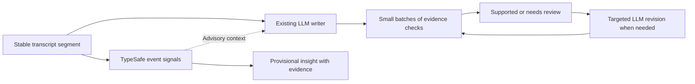

# TypeSafe API benchmark and joint LLM experiments

Run: September 17–18, 2026. All inputs were synthetic. No local text model was invoked, and no production behavior or settings were changed.

**Real-meeting follow-up:** [107.8 minutes of public AMI meetings](typesafe-real-meetings.md) confirmed fast TypeSafe calls but did not show a quality gain from broad event advice or blanket verification/repair. A fast provisional LLM writer and explicitly remembered commitments are the narrower proposals. Treat the synthetic results below as development evidence, not real-meeting accuracy.

Follow-up on request granularity: single claims also passed all 33 support checks, and are now the recommended default for live arrivals. Small batches remain useful for a ready backlog; see the final section.

The strongest proposal is a two-speed insights pipeline: TypeSafe identifies provisional events and checks evidence; the existing LLM writes and revises the notes. The measurements support fast, narrow judgments. They do not establish a production error rate or justify making TypeSafe an unconditional authority over saved insights.

## What was compared

The configured meeting API is OpenRouter `deepseek/deepseek-v4.1-flash`; cleanup uses OpenRouter `google/gemini-3.8-flash` with low reasoning. Both were tested through the application's text-generation adapter. An available OpenAI credential allowed testing the supported `gpt-4o-mini` fallback as well; it is not the active meeting or cleanup model. Groq, OpenCode Go and OpenCode Zen lacked configured credentials. Ollama was excluded as requested. Audio transcription and voice synthesis are outside this text comparison.

The actual Direct, forced Direct JSON, Pi and OpenCode meeting engines were also exercised with the configured DeepSeek model: the existing six-check live-agent regression plus a separate end-of-meeting consolidation. These are workflow probes, not the same task as a typed classification call.

The semantic comparison contains 92 frozen cases across eight families, 100 scored fields and 124 questions. Thirty-six cases reuse the earlier experiment's holdout; 56 extend it. Expected labels were excluded from API requests. Event owner/deadline fields count only for accepted actions. All four main arms share suite SHA-256 `954a576768b202beaadc0446141eb0798bebd725d94daee03e0408a63ab603fe`.

These are deliberately difficult authored examples: paraphrases, negation, changed numbers, conditional commitments, absent answers and hypothetical tasks. The repeated runs and follow-ups are development evidence, not an independent blind evaluation. Most comparisons have one run per model. Provider load, caches, reasoning settings and overlapping workflow runs can affect latency.

## Same-task API results

The main LLM results use strict JSON schemas, including exact answer names and enums. Each arm made 14 requests, grouped by family with up to eight cases per request; event batches ask three questions per case. The timing is full request latency measured locally, including network time, excluding ASR and UI scheduling.

| Model / current role | Frozen primary labels | Scored fields | Median request | Observed request range | Cost for this 92-case run |
|---|---:|---:|---:|---:|---:|
| TypeSafe `jev-1.13.0` | 90/92 | 98/100 | **0.184 s** | 0.143–0.793 s | ~$0.00116 estimated |
| DeepSeek / meeting | 91/92 | 99/100 | 7.789 s | 0.982–29.524 s | $0.01458 reported |
| Gemini / cleanup | 90/92 | 98/100 | 2.475 s | 1.427–4.283 s | $0.02668 reported |
| GPT-4o-mini / fallback | 83/92 | 91/100 | 1.098 s | 0.812–2.831 s | Not reported by response |

TypeSafe's observed median was about 42x faster than the meeting model and 13x faster than cleanup on these typed tasks. This is not a measured speedup for generating complete meeting notes. Cost entries cover these particular runs, not every experiment or an invoice. TypeSafe's estimate uses 27,687 input tokens and the documented $0.042 per million input tokens, with free output tokens. [TypeSafe model and pricing reference](https://docs.typesafe.ai/models).

| Family | Cases | TypeSafe | DeepSeek | Gemini | GPT-4o-mini |
|---|---:|---:|---:|---:|---:|
| Evidence support | 12 | 12 | 12 | 11 | 12 |
| Cleanup meaning preservation | 12 | 12 | 12 | 11 | 10 |
| Cleanup profile routing | 12 | 12 | 12 | 12 | 10 |
| Semantic duplicate detection | 12 | 11 | 12 | 12 | 11 |
| Topic change | 12 | 12 | 12 | 12 | 10 |
| Answer/evidence selection | 8 | 8 | 8 | 8 | 7 |
| Passage selection from supplied shortlist | 8 | 7 | 7 | 8 | 7 |
| Event classification | 16 | 16 | 16 | 16 | 16 |

Two frozen labels are debatable. `dedup_4` treats “recordings” and “audio files” as equivalent, although the second can have broader scope. `retrieval_6` labels “We do not have a refund policy yet” as no substantive answer, although that is useful absence information. Original labels and results are retained. Excluding both gives TypeSafe 90/90, DeepSeek 90/90, Gemini 88/90 and GPT-4o-mini 83/90. This sensitivity analysis is post hoc, not a revised headline score.

Gemini's evidence mismatch distinguishes “contradicted” from “insufficient”; both reject the unsupported claim. Its cleanup mismatch rejects a meaning-preserving paraphrase. GPT-4o-mini also accepted a cleanup that dropped a legal-approval condition. These errors have different practical consequences.

Initial plain-JSON runs scored TypeSafe 90/92, Gemini 90/92, DeepSeek 82/92 and GPT-4o-mini 76/92. DeepSeek had one failed eight-case response; GPT-4o-mini supplied the literal key `question_name` instead of the requested key on an eight-case batch. Structured follow-ups and full strict-schema runs resolved these protocol failures. The main table uses the complete strict-schema runs so output-format failures are not presented as reasoning errors.

## Existing deterministic methods and actual workflows

Using the production functions directly on their relevant challenge subsets, lexical duplicate detection scored 1/12, topic change 8/12, and knowledge-folder lexical ranking 0/8. The set intentionally contains paraphrases with few shared words and changed facts with many shared words. These figures demonstrate boundary cases, not the components' everyday accuracy. Their in-process speed and deterministic behavior remain useful; no network model is needed for exact IDs, dates, arithmetic or identical text.

The existing live-agent regression covers automatic contextual name repair, human spelling guidance, a notes rewrite without new speech, preserving legitimate “entropic,” withholding an ambiguous correction and repairing it after later context.

| Actual engine | Formal live checks | Initial correction + notes scenario | Separate final consolidation |
|---|---:|---:|---|
| Direct, normal tool path | 3/6 | 104.69 s | 113.64 s; completed, 32 items |
| Direct, forced JSON path | 6/6 | 13.03 s | 109.52 s; completed, 27 items |
| Pi | 5/6 | 65.81 s | 88.69 s; completed, 22 items |
| OpenCode | 5/6 | 32.06 s | Cancelled at 120.05 s; no items |

The formal 5/6 results for Pi and OpenCode need qualification: both failed the same bullet-rewrite assertion, which rejects any appearance of `5000`. Their actual text preserved the correct distinction “$500, not $5000,” owner, Friday deadline and pending vendor choice. That assertion is overly literal; the original test was left unchanged. Direct's notes passes returned no applied notes in the first scenarios, although cards and a corrected transcript existed. Its notes pass could exceed the experiment's 60-second checkpoint setting because retries are not a strict overall deadline.

All three completed final consolidations preserved the central Tuesday correction, $500 cap, SQLite choice and pending vendor selection. Their action interpretation differed: Direct additionally proposed asking Nia about migration and following up with legal; Direct JSON included a legal follow-up; Pi retained only Maya's explicit commitment. These are useful proposed follow-ups but should be distinguished from recorded commitments. Several proposed timeline/notes items were initially rejected by existing duplicate checks and later rephrased; raw operations preserve that behavior.

The workflow timings include multiple model calls and tool operations. The regression calls the scheduler directly, bypassing its initial 120-second context wait. Current deterministic state repair also seeds fallback cards. A 0.18-second classifier should therefore not be described as replacing a 100-second empty-screen wait. The separate consolidation had a 120-second cancellation bound and one sample per engine; this is insufficient to rank engine reliability broadly.

The actual cleanup function was separately run on 12 raw examples: all returned successful, manually reviewed meaning-preserving output. Median generation was about 1.65 seconds. TypeSafe checked all 12 together in 0.370 seconds, returned `preserved` for all, and reported confidence >=0.8 on 11. Because these outputs were already good, this probe demonstrates compatibility, not an observed reduction in cleanup errors.

## Joint use experiments

### Fast signals plus the existing LLM writer

A synthetic 12-segment meeting included a corrected deadline, a $500/$5000 distinction, an unaccepted owner suggestion, a fictional purchase approval, a real SQLite decision and an unanswered customer-data question. TypeSafe evaluated 48 action/decision/question/correction signals before the same Gemini writer. The writer still received the full transcript and was told the signals were fallible.

Two repetitions per arm, alternating order:

| Pipeline | Time to provisional signals | LLM generation | Total including verification |
|---|---:|---:|---:|
| LLM alone, run 1 | — | 3.677 s | 3.919 s |
| Signals + LLM, run 1 | 0.150 s | 2.511 s | 2.781 s |
| Signals + LLM, run 2 | 0.203 s | 3.186 s | 3.604 s |
| LLM alone, run 2 | — | 3.623 s | 3.763 s |

Manual review found all 27 generated insights across these runs supported by the source. Both arms preserved the important corrections and uncertainty. Two repetitions do not establish that advisory signals improve writing quality or cause faster generation. They do demonstrate a much earlier opportunity to display provisional, evidence-linked signals.

A separate scaling probe ran 3, 12 and 48 questions with three repetitions each. Without distractors, median times were 155, 188 and 178 milliseconds; every scored field matched its expected label. Adding 4,500 repetitive unrelated words gave 293, 170 and 258 milliseconds, again without scored errors. This is simple synthetic noise, not evidence of robust performance on long, contradictory meeting history. The original artifact's `distractor_words` metadata incorrectly says 4,000; the retained payload actually contains 4,500. The summary derives the actual word count, and the runner now records it correctly.

### LLM draft → narrow verification → targeted repair

The initial whole-insight verifier caught four deliberately corrupted controls: a superseded Friday deadline, assigning migration to uncommitted Nia, a $5000 cap and treating fictional approval as real. A correct action scored 0.97; the four corruptions scored 0.02–0.04. However, a correct SQLite decision scored only 0.86, and many supported natural insights would be deferred by a blanket 0.9 acceptance threshold. Broad questions are too conservative for automatic gating here.

Splitting text support, owner support and deadline support exposed another important limit:

| Verification layout on identical claims | Text verdicts correct |
|---|---:|
| 33 checks in one shared request | **21/33** |
| Same checks split into batches of at most eight | **33/33** |

The sliced result includes 27 natural claims, two valid controls and four invalid controls. Thirty-two text verdicts had confidence >=0.8; one valid compound claim scored 0.75. Five requests took 0.141–0.311 seconds each, 1.035 seconds serial total. Owner/deadline probabilities also improved under slicing; the wrong-deadline control retained uncertainty about its otherwise-correct owner. We did not diagnose whether question count, state size, indexing or a combination caused the large-batch failure. Eight is a measured starting point for this verifier, not a universal API limit.

The four flagged controls were passed back to Gemini with the source transcript. In 2.293 seconds it corrected the deadline and amount, and dropped the unaccepted migration assignment and fictional approval. Rechecking the two repairs returned broad-support probabilities 0.97 and 0.68, reinforcing the need for narrow checks and a review state. This is a successful controlled repair demonstration; the four deliberately injected faults were not naturally occurring errors in the earlier Gemini outputs.

The architecture follows the extract → verify → escalate pattern in the official [SDE cascade cookbook](https://docs.typesafe.ai/cookbooks/sde_cascade). Our measurements use the configured models and our fixtures, rather than inheriting the cookbook's claimed performance. Task-specific thresholds are consistent with the [confidence documentation](https://docs.typesafe.ai/confidence). Keeping state narrow and calculations in code also follows the documented [Jev 1.13 limitations](https://docs.typesafe.ai/model-jaggedness/jev-1.13).

### Confidence routing to the LLM

A TypeSafe-first cascade routed 9/92 cases to Gemini, in five extra LLM requests, using a provisional 0.8 threshold on relevant fields. It scored 89/92, took 15.50 seconds for the serial suite and cost approximately $0.00536: $0.004194 provider-reported Gemini usage plus $0.001163 estimated TypeSafe usage. The routed LLM received the task independently, without TypeSafe's answer.

This reduced observed generation cost compared with the full Gemini runs, but did not improve exact-label accuracy. One discrepancy was the harmless contradicted/insufficient distinction; the two ambiguous fixtures remained. Confidence is not a calibrated guarantee for our application. Routing is a later optimization after per-task evaluation, rather than the first integration.

### Query expansion + existing search + TypeSafe selection

The 7/8 passage-selection result above assumes the relevant passage is already in a supplied shortlist. A further experiment removed that assumption: Gemini expanded eight queries without seeing the corpus; an in-memory SQLite FTS5 index applied production-style AND terms; TypeSafe selected among actual hits. The corpus contained the 24 synthetic passages from the challenge set.

Literal search found the labeled passage for 0/6 answerable queries; query expansion improved this to only 2/6. Final exact selection was 3/8 overall. Besides the ambiguous refund fixture, one result selected an encryption passage for a query about offline privacy while missing the actual policy. Retrieval remains constrained by candidate recall and requires separate indexing/retrieval work. I would not prioritize this joint feature yet.

## Proposed changes, in order

1. **Provisional insights after stable transcript segments.** Add an asynchronous semantic worker that examines a small recent window for accepted action, decision, open question and correction signals. Show an evidence-linked provisional marker; let the existing LLM create readable notes and reconcile it later. Candidate owners/deadlines should come from known participants and locally extracted values, with explicit unknown choices. The closed candidate sets in these experiments do not prove unrestricted name/date extraction. Measure latency from stable ASR text separately from speech-to-screen latency.
2. **Verification alongside LLM drafts.** Start by recording verdicts without changing visible or saved output. Check claim text, owner and deadline separately in small batches; preserve evidence IDs and source revisions. Promote reliable checks to review flags and targeted regeneration once measured on unseen meetings. Preserve uncertain claims for review instead of silently deleting them. Give suggested follow-ups their own status so “ask Nia” cannot become “Nia accepted.”
3. **Meaning-aware updates.** Use TypeSafe to distinguish a paraphrase from a changed amount, negation, owner or deadline before an LLM revision merges cards. Use correction signals to wake the writer for important changes, and answer-selection signals to mark questions as potentially answered. These components scored well separately; the combined interactive experience remains a proposal.
4. **Cleanup verification and profile suggestions.** Add an optional post-cleanup meaning check that respects the active profile's authorized transformations. Start with flagged changes and original-text recovery. Suggest email/support-ticket formatting from intent while preserving explicit user selection. The existing configured cleanup already passed this small live probe.
5. **Defer generic cascades and retrieval reranking.** The confidence cascade saved cost without improving accuracy, and the end-to-end retrieval experiment was weak. Address them after the insights and verifier layers have real evaluation data.

Concrete integration points are [scheduler](../meeting/agent/scheduler.py), [bulk and single-operation engine paths](../meeting/engine.py), [evidence and duplicate checks](../meeting/state/patches.py), [state store](../meeting/state/store.py), and [cleanup](../services/transcript_cleanup.py). Existing evidence validation establishes ID validity, not semantic entailment. A shared checker must cover both `apply_agent_ops` and `_apply_single_agent_op`; a later reinsight path also needs the same policy. HTTP calls must occur outside the store lock. Bind results to claim and segment revisions, discard stale responses, and recheck current edit authority before applying anything. Retain the application's cloud-enabled setting for the additional API path.

A suitable first implementation would contain a small pinned TypeSafe adapter, a bounded background queue, evidence-scoped request builders, a provisional-status field and per-task evaluation logs. Use bounded timeouts and concurrency, cache by content/revision plus model/prompt version, and allow the existing writer to proceed if classification fails. Keep all deterministic integrity checks. The current 120-second initial LLM context wait and subsequent adaptive cadence should be evaluated independently before changing scheduler behavior.



Next evaluation should use fresh labeled sessions with realistic ASR mistakes, overlapping speakers, corrections and unrelated history. Separate false accepted commitments, missed events, false review flags, stale-result drops, time to provisional feedback and time to final notes. Thresholds should be chosen on development data and evaluated once on an untouched set. The current experiments justify a feature-flagged prototype and do not justify automatic semantic rejection in production.

## Artifacts and reproduction

[Machine-readable summary](../benchmarks/typesafe_results/comparison-summary.json) is retained in the repository and can be rebuilt by [typesafe_report.py](../benchmarks/typesafe_report.py) when the original raw results are available locally. Raw requests, outputs, timings, usage and synthetic fixtures under `benchmarks/typesafe_results/` are ignored by Git; only `comparison-summary.json` is retained. The [earlier report](typesafe-experiments.md) covers the original 72-example experiment and shared-state token savings.

Runner commands below make paid API calls only when `--live` is supplied. Use new output filenames; live runners refuse to overwrite prior results. Credentials are resolved locally and are not written into artifacts.

```powershell
. .\venv\Scripts\Activate.ps1
python -m benchmarks.typesafe_comparison --arm typesafe --live --output benchmarks/typesafe_results/new-typesafe.json
python -m benchmarks.typesafe_comparison --arm meeting --strict-json --max-output 8192 --live --output benchmarks/typesafe_results/new-meeting.json
python -m benchmarks.typesafe_comparison --arm cleanup --strict-json --max-output 8192 --live --output benchmarks/typesafe_results/new-cleanup.json
python -m benchmarks.typesafe_comparison --arm openai --strict-json --max-output 8192 --live --output benchmarks/typesafe_results/new-openai.json
python -m benchmarks.typesafe_comparison --arm deterministic --output benchmarks/typesafe_results/new-deterministic.json
python -m benchmarks.typesafe_agent_comparison --harness direct-json --live --output benchmarks/typesafe_results/new-agent.json
python -m benchmarks.typesafe_consolidation_probe --harness direct-json --live --output benchmarks/typesafe_results/new-consolidation.json
python -m benchmarks.typesafe_hybrid --mode insights --live --output benchmarks/typesafe_results/new-insights.json
python -m benchmarks.typesafe_hybrid --mode cascade --live --output benchmarks/typesafe_results/new-cascade.json
python -m benchmarks.typesafe_followups --mode scaling --live --output benchmarks/typesafe_results/new-scaling.json
python -m benchmarks.typesafe_cleanup_probe --live --output benchmarks/typesafe_results/new-cleanup-production.json
python -m benchmarks.typesafe_retrieval_probe --live --output benchmarks/typesafe_results/new-retrieval.json
python -m benchmarks.typesafe_report
```

The verification follow-up modes intentionally read the saved `hybrid-insights.json` and `followup-verification.json` artifacts to compare identical drafts. The offline report likewise summarizes the named recorded runs, not arbitrary new output names. These raw inputs are local artifacts and are not included in a fresh checkout; restore them locally before running the dependent follow-ups or rebuilding the summary. For the other agent paths, repeat the agent/consolidation commands with `direct`, `pi` and `opencode`.

Validation: 15 focused offline tests cover label exclusion, evidence IDs, request binding, strict schemas, failure accounting and use of actual deterministic functions. Ruff F checks pass on the benchmark scripts and tests. No production files were edited.


## Follow-up: one claim per call (September 18)

The user's question prompted a direct comparison of one claim per request, one question per request, and eight claims per request. Eight was previously a successful follow-up size, not an established optimum.

The same 33 saved claims and exact question meanings were used. Single-claim requests include only that claim and its cited evidence, with the text, owner and deadline questions kept together. Single-question requests split those related questions too. Expected labels stayed outside the requests. Each configuration ran twice, in reversed order on the second repetition, with fresh pooled HTTP clients per configuration. Concurrent configurations allowed four in-flight requests, with request starts capped at 20 per second. No automatic retries were used, and all errors would count in the accuracy denominator.

| Request unit | Concurrency | Requests for 33 claims | Time for all claims, two runs | Input tokens per run | Estimated cost per run |
|---|---:|---:|---:|---:|---:|
| One claim | 1 | 33 | 7.41 / 9.59 s | 17,876 | $0.000751 |
| One claim | 4 | 33 | **2.26 / 2.25 s** | 17,876 | $0.000751 |
| Eight claims | 1 | 5 | 1.10 / 1.48 s | 10,484 | $0.000440 |
| Eight claims | 4 | 5 | **0.64 / 0.65 s** | 10,484 | $0.000440 |
| One question | 4 | 46 | 2.97 / 3.97 s | 23,963 | $0.001006 |

Every configuration matched **33/33 text-support labels in both runs**. All 244 requests completed without API or schema errors. Isolating claims gave text confidence >=0.8 on all 33; the eight-claim layouts retained one valid compound claim below 0.8. Higher confidence is not independent proof of greater reliability. Owner/deadline probabilities are retained in raw results but are not included in the 33-label score.

Median HTTP latency for individual single-claim requests was 156–190 ms across these runs. The total-set timings include client setup, connection establishment, concurrency limits and queueing; they are not each claim's model latency. The request-start cap also limits bulk throughput. These measurements do not establish the service's maximum throughput or what unbounded concurrency would achieve.

Batching eight used about 41% fewer input tokens than one-claim calls here and cleared an already available backlog faster. Splitting every text/owner/deadline question into its own call repeated more context and increased requests without changing text-label accuracy. This is consistent with TypeSafe's [parallel questions over shared state](https://docs.typesafe.ai/patterns/fan-out) design.

**Updated recommendation:** submit each live claim immediately, with its own narrow cited context, keeping related independent questions together. Use bounded concurrency and show each result when it arrives. Do not wait to collect eight live claims. When an LLM draft or final consolidation already supplies many claims, small batches can reduce requests, tokens and time to process the backlog. The one-claim layout is also a useful fallback for ambiguous compound checks. Both layouts still need evaluation on unseen realistic meetings.

This refines the earlier recommendation: choose the request unit around a coherent claim and the application's latency needs, rather than fixing one batch size globally. Network calls remain outside the state lock and results still need revision/freshness checks.

Artifacts: raw requests, responses and timings are stored locally in `benchmarks/typesafe_results/followup-granularity.json` (ignored by Git); the [live runner](../benchmarks/typesafe_granularity_probe.py) and [three offline binding/failure-accounting tests](../tests/test_typesafe_granularity.py) remain in the repository. The three new tests and Ruff F checks pass. Production behavior remains unchanged.

```powershell
. .\venv\Scripts\Activate.ps1
python -m benchmarks.typesafe_granularity_probe --live --output benchmarks/typesafe_results/new-granularity.json
```
